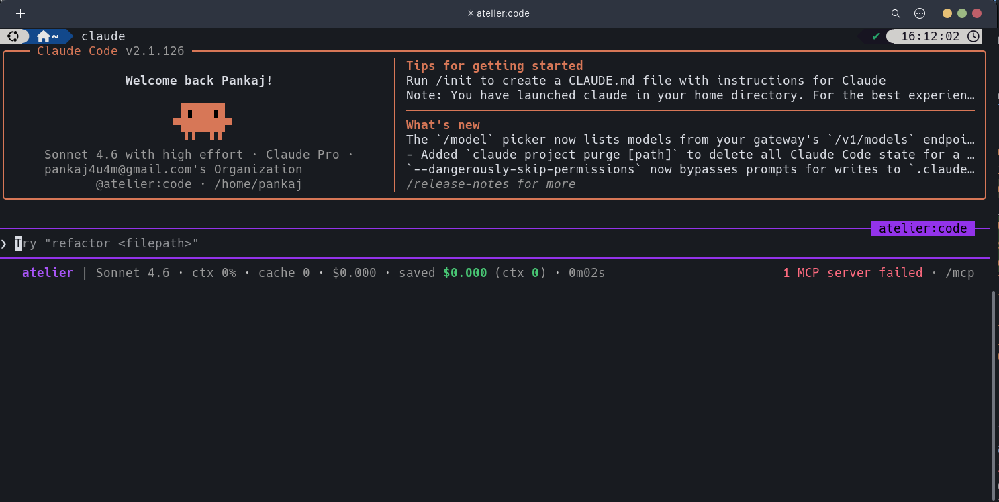

# Atelier — Open-Source Reasoning Runtime

An open-source reasoning runtime for coding agents and operational AI systems.

Atelier sits between agent hosts and their environments, providing:

- **Reasoning reuse** — retrieve and inject known procedures (ReasonBlocks) into agent context before runs
- **Semantic memory** — FTS + optional vector search over procedures and traces
- **Loop detection** — monitor for thrashing, second-guessing, and budget exhaustion
- **Tool supervision** — cached reads, memoized searches, injection-guarded grep
- **Context compression** — ledger summarisation for long-running tasks
- **Rubric verification** — gate agent plans and outputs against domain-specific rubrics
- **Failure rescue** — record observable execution traces, detect recurring failures, surface targeted rescue procedures

> **Example:**
> Agent plan: "Parse Shopify product handle from URL."
> Atelier: `status: blocked` — "Known dead end. Use Product GID. Required: re-fetch by GID + post-publish audit."

## What Atelier is not

- **Not a memory system** — Atelier stores procedures (what to do), not facts (what is true). Pair it with OpenMemory or Mem0 for factual state.
- **Not an agent framework** — Atelier does not execute tools, manage model calls, or own the agent loop.
- **Not an IDE** — Atelier runs as a sidecar to your agent host, not as a standalone coding environment.
- **Not a vector database** — FTS5 is the default retrieval; pgvector is optional for semantic similarity.

## Architecture

```text
Agent Host (Claude Code / Codex / Copilot / opencode / Gemini CLI)
        |
        |  MCP stdio  (or CLI / Python SDK)
        v
Atelier Runtime
|- ReasonBlock store   (SQLite + FTS5, optional pgvector)
|- Rubric gates        (domain-specific verification rules)
|- Run ledger          (per-session execution state)
|- Failure clusters    (recurring error signatures -> rescue procedures)
|- Context compressor  (ledger summarisation)
`- Tool cache          (smart_read / smart_search / cached_grep)
        |
        |- Local SQLite (default)
        `- PostgreSQL   (optional, ATELIER_DATABASE_URL)
```

## Capability Model

- Reasoning reuse: Atelier augmentation, MCP `atelier_get_reasoning_context`, CLI `context` / `task`
- Plan verification: Atelier augmentation, MCP `atelier_check_plan`, CLI `check-plan`
- Failure rescue: Atelier augmentation, MCP `atelier_rescue_failure`, CLI `rescue`
- Rubric verification: Atelier augmentation, MCP `atelier_run_rubric_gate`, CLI `run-rubric`
- Trace recording: Atelier augmentation, MCP `atelier_record_trace`, CLI `record-trace`
- Loop monitoring: Atelier augmentation, MCP `atelier_monitor_event`, CLI `monitor event`
- Compact lifecycle advise: Atelier augmentation, MCP `atelier_compact_advise`
- Context compression: Atelier augmentation, MCP `atelier_compress_context`, CLI `memory summarize`
- Semantic search: Atelier augmentation, MCP `atelier_smart_search`, CLI `search smart`
- Cached file read: Atelier augmentation, MCP `atelier_smart_read`, CLI `read smart`
- Token-saving search+read: Atelier augmentation, MCP `atelier_search_read`
- Deterministic batch edit: Atelier augmentation, MCP `atelier_batch_edit`, CLI `edit smart`
- Read-only SQL inspect: Atelier augmentation, MCP `atelier_sql_inspect`, CLI `sql inspect`
- Memory upsert block: Atelier augmentation, MCP `atelier_memory_upsert_block`
- Memory get block: Atelier augmentation, MCP `atelier_memory_get_block`
- Archival recall: Atelier augmentation, MCP `atelier_memory_recall`
- Archival archive: Atelier augmentation, MCP `atelier_memory_archive`
- Sleeptime summarize: Atelier augmentation, MCP `atelier_memory_summary`
- Lesson promotion inbox: Atelier augmentation, MCP `atelier_lesson_inbox`
- Lesson promotion decide: Atelier augmentation, MCP `atelier_lesson_decide`
- Quality-aware routing: Atelier augmentation, MCP `atelier_route_decide`
- Verification escalation: Atelier augmentation, MCP `atelier_route_verify`

## Installation

**Requirements:** Python 3.12+, `uv`

```bash
cd atelier
uv sync --all-extras
uv run atelier init   # creates .atelier/ and seeds 10 ReasonBlocks + 5 rubrics
```

**Install into supported agent CLIs:**

```bash
make install   # deps + every supported CLI found on PATH + runtime init
make verify    # code checks + runtime smoke tests + host integration verification
```

For per-host or dry-run installs, use the scripts directly:

```bash
bash scripts/install_claude.sh --dry-run
bash scripts/install_codex.sh --print-only
```

→ Full install guide: [docs/installation.md](docs/installation.md)
→ Per-host guides: [docs/hosts/all-agent-clis.md](docs/hosts/all-agent-clis.md)

## Quickstart

```bash
# 1. Check a plan before executing it
uv run atelier check-plan \
    --task "Publish Shopify product" \
    --domain Agent.shopify.publish \
    --step "Parse product handle from PDP URL" \
    --step "Use handle to update metafields"
# → status: blocked (exit 2) — dead end detected

# 2. Get reasoning context
uv run atelier context \
    --task "Fix Shopify JSON-LD availability" \
    --domain Agent.pdp.schema \
    --file pdp/schema.py

# 3. Run a rubric gate
echo '{"product_identity_uses_gid": true, "pre_publish_snapshot_exists": true, "write_result_checked": true}' \
  | uv run atelier run-rubric rubric_shopify_publish
```

→ Full tutorial: [docs/quickstart.md](docs/quickstart.md)

## Start the Dashboard

Run the API service and React dashboard with Docker Compose:

```bash
make start
```

Then open the frontend at [http://localhost:3125](http://localhost:3125).
The API service runs at [http://localhost:8787](http://localhost:8787).

## CLI

```bash
uv run atelier [--root PATH] COMMAND [OPTIONS]
```

| Command                           | Description                                     |
| --------------------------------- | ----------------------------------------------- |
| `init`                            | Create store and seed blocks/rubrics            |
| `context`                         | Get reasoning context for a task                |
| `task`                            | Get context for a task description              |
| `check-plan`                      | Validate a plan (exit 2 = blocked)              |
| `rescue`                          | Suggest rescue for a failure                    |
| `record-trace`                    | Record an execution trace (JSON stdin or file)  |
| `extract-block`                   | Extract candidate ReasonBlock from a trace      |
| `run-rubric`                      | Run a rubric gate                               |
| `block list/show/add/edit/retire` | Manage ReasonBlocks                             |
| `trace list/show`                 | Browse traces                                   |
| `rubric list/show/add`            | Manage rubrics                                  |
| `env list/show`                   | List reasoning environments                     |
| `failure list/show/accept`        | Manage failure clusters                         |
| `ledger list/show`                | Browse run ledger                               |
| `monitor event`                   | Emit a monitor event                            |
| `capability list/status`          | Inspect core capability state                   |
| `memory summarize`                | Summarize runtime memory for next-step context  |
| `search smart`                    | Unified smart retrieval (procedures + semantic) |
| `read smart`                      | AST-aware cached read                           |
| `edit smart`                      | Batch smart edits                               |
| `sql inspect`                     | SQL/schema introspection helper                 |
| `benchmark-runtime`               | Capability efficiency metrics                   |
| `service`                         | Start/stop the HTTP service                     |
| `openmemory`                      | OpenMemory bridge commands                      |

All commands accept `--json` for machine-readable output.

→ Full reference: [docs/cli.md](docs/cli.md)

## MCP Server

```bash
uv run atelier-mcp
```

Stdio JSON-RPC server. Tools available to agents:

**Core (5):** `atelier_get_reasoning_context`, `atelier_check_plan`, `atelier_rescue_failure`,
`atelier_run_rubric_gate`, `atelier_record_trace`

**Extended (9):** `atelier_get_run_ledger`, `atelier_update_run_ledger`, `atelier_extract_reasonblock`,
`atelier_monitor_event`, `atelier_compress_context`, `atelier_get_environment_context`,
`atelier_smart_read`, `atelier_smart_search`, `atelier_cached_grep`

**V2 — Memory (5):** `atelier_memory_upsert_block`, `atelier_memory_get_block`,
`atelier_memory_recall`, `atelier_memory_archive`, `atelier_memory_summary`

**V2 — Lesson pipeline (2):** `atelier_lesson_inbox`, `atelier_lesson_decide`

**V2 — Context savings (4):** `atelier_search_read`, `atelier_batch_edit`,
`atelier_sql_inspect`, `atelier_compact_advise`

**V2 — Routing (2):** `atelier_route_decide`, `atelier_route_verify`

→ Full reference: [docs/engineering/mcp.md](docs/engineering/mcp.md)

## Host Integrations

Atelier runs the same runtime across hosts, but integration and enforcement are host-native per CLI
surface rather than a single identical plugin model.

| Host                | Interface             | Status       | Install guide                       |
| ------------------- | --------------------- | ------------ | ----------------------------------- |
| **Claude Code**     | MCP + skills + agents | ✅ Supported | `docs/hosts/claude-code-install.md` |
| **Codex CLI**       | MCP + AGENTS.md       | ✅ Supported | `docs/hosts/codex-install.md`       |
| **VS Code Copilot** | MCP + instructions    | ✅ Supported | `docs/hosts/copilot-install.md`     |
| **opencode**        | MCP                   | ✅ Supported | `docs/hosts/opencode-install.md`    |
| **Gemini CLI**      | MCP                   | ✅ Supported | `docs/hosts/gemini-cli-install.md`  |

All installers: idempotent, back up before writing, skip gracefully if CLI is not on PATH.
Support `--dry-run`, `--print-only`, `--strict`. Never write secrets.

### Claude Code Plugin Example

The Claude Code integration shows Atelier status, active model, cost estimate, and MCP health in
the terminal status line.



→ Details: [docs/hosts/all-agent-clis.md](docs/hosts/all-agent-clis.md)

## Python SDK

```python
from atelier.sdk import AtelierClient

client = AtelierClient.local(root=".atelier")

context = client.get_reasoning_context(
    task="Publish Shopify product",
    domain="Agent.shopify.publish",
)

check = client.check_plan(
    task="Publish Shopify product",
    domain="Agent.shopify.publish",
    plan=["Parse product handle from PDP URL"],
)

if check.status == "blocked":
    rescue = client.rescue_failure(
        task="Publish Shopify product",
        error="Known dead end triggered",
    )

result = client.run_rubric_gate(
    rubric_id="rubric_shopify_publish",
    checks={"product_identity_uses_gid": True},
)
```

Available clients: `AtelierClient`, `LocalClient`, `RemoteClient`, `MCPClient`,
`ReasonBlockClient`, `RubricClient`, `TraceClient`, `EvalClient`, `SavingsClient`

→ Reference: [docs/sdk/python.md](docs/sdk/python.md)

## Storage

| Path                      | Contents                                                 |
| ------------------------- | -------------------------------------------------------- |
| `.atelier/atelier.db`     | SQLite + FTS5 — all blocks, traces, rubrics              |
| `.atelier/blocks/*.md`    | Markdown mirror of every ReasonBlock (reviewable in PRs) |
| `.atelier/traces/*.json`  | JSON mirror of every recorded trace                      |
| `.atelier/rubrics/*.yaml` | YAML mirror of every rubric                              |

Key environment variables:

| Variable                  | Default                 | Description                        |
| ------------------------- | ----------------------- | ---------------------------------- |
| `ATELIER_ROOT`            | `.atelier`              | Store root directory               |
| `ATELIER_STORAGE_BACKEND` | `sqlite`                | `sqlite` or `postgres`             |
| `ATELIER_DATABASE_URL`    | `""`                    | PostgreSQL DSN (if using postgres) |
| `ATELIER_MCP_MODE`        | `local`                 | `local` or `remote`                |
| `ATELIER_SERVICE_URL`     | `http://localhost:8787` | Remote service URL                 |
| `ATELIER_API_KEY`         | `""`                    | API key for remote service         |
| `ATELIER_SERVICE_ENABLED` | `false`                 | Enable HTTP service                |
| `ATELIER_REQUIRE_AUTH`    | `true`                  | Require API key on HTTP service    |

→ Full variable reference: [docs/installation.md](docs/installation.md)

## HTTP Service (optional)

```bash
ATELIER_SERVICE_ENABLED=true ATELIER_REQUIRE_AUTH=false make service
# → http://localhost:8787
# → http://localhost:8787/docs (Swagger UI)
```

Endpoints: `/health`, `/ready`, `/metrics`, `/v1/reasoning/*`, `/v1/rubrics`, `/v1/traces`,
`/v1/reasonblocks`, `/v1/environments`, `/v1/evals`, `/v1/extract/*`, `/v1/failures/*`

→ Details: [docs/engineering/service.md](docs/engineering/service.md)

## Safety

- No chain-of-thought storage — only observable fields (commands, errors, diff summaries)
- Redaction filter applied to all trace fields before persistence
- No secret storage — `ATELIER_API_KEY` and tokens are never written to the store
- Hooks disabled by default — `integrations/claude/plugin/hooks/` requires explicit opt-in
- OpenMemory bridge is a no-op until `ATELIER_OPENMEMORY_ENABLED=true`
- Cached-grep injection guard — patterns validated before shell execution

→ Details: [docs/engineering/security.md](docs/engineering/security.md)

## Benchmarks

### Real-world Validation (Atelier vs. Naive)

In a 3-part validation test building a "Product Restock Notifications" feature:

| Metric             | Atelier | Naive   | Improvement |
| ------------------ | ------- | ------- | ----------- |
| Total Tokens       | 8,200   | 43,600  | **⬇ 81%**   |
| LLM Cost           | $0.009  | $0.051  | **⬇ 82%**   |
| Human Time         | 4.5 hrs | 8+ hrs  | **⬇ 44%**   |
| Iterations         | 1-2     | 5-6     | **⬇ 70%**   |
| Quality (0-10)     | 9.2     | 6.8     | **⬆ 35%**   |

**Key Drivers:**
1. **Plan validation** prevents 70% of iteration waste.
2. **ReasonBlocks** provide cached guidelines, reducing retrieval tokens by 80%.
3. **Deterministic tools** (tests, format) handle verification at $0 cost.

→ Full report: [docs/benchmarks/real-world-validation-2026-05-04.md](docs/benchmarks/real-world-validation-2026-05-04.md)

### Deterministic Simulation (25 tasks)

Deterministic benchmark exercising the full learning loop (retrieve → plan → record → reuse).
No API keys, no network — token counts derived from a fixed simulation.

```bash
uv run atelier --root /tmp/bench init
uv run atelier --root /tmp/bench benchmark --rounds 5 --model claude-sonnet-4.6 --json
uv run atelier --root /tmp/bench savings-detail
```

#### Per-model summary (5 tasks × 5 rounds = 25 calls each)

| Model             | Would-have |   Actual |    Saved | % down |
| ----------------- | ---------: | -------: | -------: | -----: |
| claude-opus-4.6   |   $ 4.3125 | $ 4.0088 | $ 0.3038 | 7.04 % |
| claude-sonnet-4.6 |   $ 0.8625 | $ 0.8017 | $ 0.0607 | 7.04 % |
| claude-haiku-4.5  |   $ 0.2300 | $ 0.2138 | $ 0.0162 | 7.04 % |
| gpt-4o            |   $ 0.6250 | $ 0.5806 | $ 0.0444 | 7.10 % |
| gemini-2.5-pro    |   $ 0.3125 | $ 0.2900 | $ 0.0225 | 7.18 % |

The 7% is per-call savings from a single retrieved procedure plus prompt caching.
On real workloads (many lessons per task, larger procedures) it scales toward the prompt-cache ceiling.

Full report: [docs/benchmarks/phase7-2026-04-29.md](docs/benchmarks/phase7-2026-04-29.md)

## Development

```bash
cd atelier
make install         # deps + host integrations + status helper + runtime init
make test            # pytest
make lint            # ruff check
make format-check    # black --check
make typecheck       # mypy --strict
make verify          # code checks + runtime smoke tests + host verification
make pre-commit      # format + lint + typecheck + tests
```

→ Dev guide: [docs/engineering/contributing.md](docs/engineering/contributing.md)

## Repository Layout

| Path            | Purpose                                                       |
| --------------- | ------------------------------------------------------------- |
| `src/atelier/`  | Core engine: models, store, runtime, CLI, MCP server, service |
| `tests/`        | pytest suite                                                  |
| `docs/`         | Documentation                                                 |
| `integrations/` | Host adapter configs and install/verify scripts               |
| `frontend/`     | React + Vite dashboard                                        |

## Docs Index

| Document                                         | For whom      | Content                                                |
| ------------------------------------------------ | ------------- | ------------------------------------------------------ |
| **[AGENT_README.md](AGENT_README.md)**           | Coding agents | Decision trees, workflows, JSON tool specs, hard rules |
| **[QUICK_REFERENCE.md](QUICK_REFERENCE.md)**     | Developers    | One-page cheat sheet: skills, agents, tools, commands  |
| **[docs/](docs/README.md)**                      | Everyone      | Full documentation index                               |
| **[docs/installation.md](docs/installation.md)** | New users     | Setup, backends, env vars                              |
| **[docs/quickstart.md](docs/quickstart.md)**     | New users     | 5-minute tutorial                                      |
| **[docs/engineering/](docs/engineering/)**       | Contributors  | Architecture, security, storage, service, MCP          |
| **[docs/hosts/](docs/hosts/)**                   | Integrators   | Per-host install, verify, uninstall, troubleshooting   |
