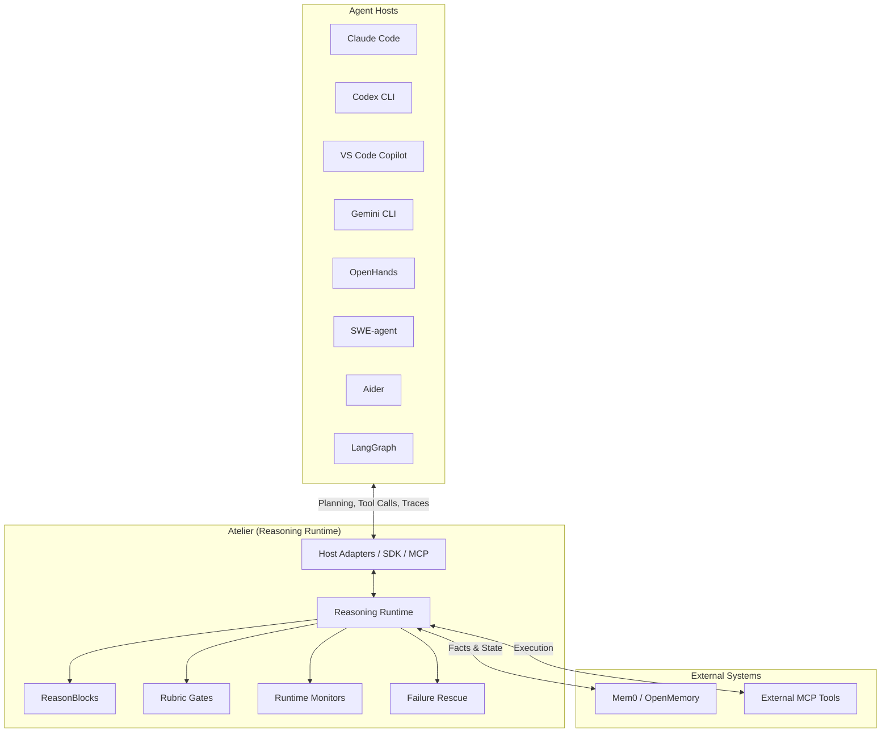

# Atelier — The Open-Source Reasoning Runtime

## Core Runtime Architecture

Atelier now runs a single orchestration engine with internal capabilities:

- reasoning reuse
- semantic file memory
- loop detection
- tool supervision
- context compression

Core references:

- `docs/core/runtime.md`
- `docs/core/capabilities.md`
- `docs/core/benchmarking.md`

Atelier is an **open-source reasoning, procedure, and runtime layer** designed for ALL major agent ecosystems. It is installable, embeddable, extensible, and benchmarkable.

It does three things:

1. **Reasoning reuse** — retrieve and inject known procedures (ReasonBlocks) into agent context before runs.
2. **Failure rescue** — record observable execution traces, detect recurring failures, surface targeted rescue procedures.
3. **Verification** — gate agent plans and outputs against domain-specific rubrics before and after execution.

**What Atelier is not:** It is not a memory layer, not a standalone IDE, not a standalone coding agent, and not a closed plugin. We do not store chain-of-thought. We store explicit, reviewable procedures and observable execution traces.

> **First magical moment:**
> Agent plan: "Parse Shopify product handle from URL."
> Atelier: `status: blocked` — "Known Agent dead end. Use Product GID. Required: re-fetch by GID + post-publish audit."

## Ecosystem Architecture

Atelier is a multi-modal runtime layer that integrates seamlessly with hosts, memory systems, and tools.



Inspired by Lemma-style failure analysis and rubric-based verification.

## Install

```bash
cd atelier
uv sync --all-extras
uv run atelier init   # creates .atelier/ and seeds 10 ReasonBlocks + 5 rubrics
```

**Install Atelier into all available agent CLIs:**

```bash
make install-agent-clis   # installs into every CLI found on PATH (gracefully skips missing ones)
make verify-agent-clis    # verifies each integration is wired correctly
```

Individual installs: `make install-claude`, `make install-codex`, `make install-opencode`,
`make install-copilot`, `make install-gemini`

→ Full details: [docs/installation.md](docs/installation.md)
→ Per-host install guides: [docs/hosts/all-agent-clis.md](docs/hosts/all-agent-clis.md)

## Quickstart (5 minutes)

```bash
# 1. Check a plan before executing it
uv run atelier check-plan \
    --task "Publish Shopify product" \
    --domain Agent.shopify.publish \
    --step "Parse product handle from PDP URL" \
    --step "Use handle to update metafields"
# → status: blocked (exit 2) — dead end detected

# 2. Get reasoning context
uv run atelier context \
    --task "Fix Shopify JSON-LD availability" \
    --domain Agent.pdp.schema \
    --file pdp/schema.py

# 3. Run a rubric gate
echo '{"product_identity_uses_gid": true, "pre_publish_snapshot_exists": true, "write_result_checked": true}' \
  | uv run atelier run-rubric rubric_shopify_publish
```

→ Full tutorial: [docs/quickstart.md](docs/quickstart.md)

## CLI

```bash
uv run atelier [--root PATH] COMMAND [OPTIONS]
```

| Command                           | Description                                    |
| --------------------------------- | ---------------------------------------------- |
| `init`                            | Create store and seed blocks/rubrics           |
| `context`                         | Get reasoning context for a task               |
| `task`                            | Get context for a task description             |
| `check-plan`                      | Validate a plan (exit 2 = blocked)             |
| `rescue`                          | Suggest rescue for a failure                   |
| `record-trace`                    | Record an execution trace (JSON stdin or file) |
| `extract-block`                   | Extract candidate ReasonBlock from a trace     |
| `run-rubric`                      | Run a rubric gate                              |
| `block list/show/add/edit/retire` | Manage ReasonBlocks                            |
| `trace list/show`                 | Browse traces                                  |
| `rubric list/show/add`            | Manage rubrics                                 |
| `env list/show`                   | List reasoning environments                    |
| `failure list/show/accept`        | Manage failure clusters                        |
| `ledger list/show`                | Browse run ledger                              |
| `monitor event`                   | Emit a monitor event                           |
| `capability list/status`          | Inspect core capability state                  |
| `memory summarize`                | Summarize runtime memory for next-step context |
| `search smart`                    | Unified smart retrieval (procedures + semantic) |
| `read smart`                      | AST-aware cached read                          |
| `edit smart`                      | Batch smart edits                              |
| `sql inspect`                     | SQL/schema introspection helper                |
| `benchmark-runtime`               | Capability efficiency metrics                  |
| `benchmark-host`                  | Host verification benchmark alias              |
| `service`                         | Start/stop the HTTP service                    |
| `openmemory`                      | OpenMemory bridge commands                     |

All commands accept `--json` for machine-readable output.

→ Full reference: [docs/cli.md](docs/cli.md)

## MCP Server (for Codex / Claude Code / Copilot / opencode / Gemini CLI)

```bash
uv run atelier-mcp
```

Stdio JSON-RPC server. Tools available to agents:

**V1 (core):** `atelier_get_reasoning_context`, `atelier_check_plan`, `atelier_rescue_failure`, `atelier_run_rubric_gate`, `atelier_record_trace`, `atelier_search`

**V2 (extended):** `atelier_get_run_ledger`, `atelier_update_run_ledger`, `atelier_monitor_event`, `atelier_compress_context`, `atelier_get_environment`, `atelier_get_environment_context`, `atelier_smart_read`, `atelier_smart_search`, `atelier_cached_grep`

**Core capabilities:** `atelier_reasoning_reuse`, `atelier_semantic_memory`, `atelier_loop_monitor`, `atelier_tool_supervisor`, `atelier_context_compressor`, `atelier_smart_search`, `atelier_smart_read`, `atelier_smart_edit`, `atelier_sql_inspect`

→ Integration guides: [docs/hosts/](docs/hosts/)

## Installation & Integration Matrices

### Installation Matrix

| Deployment Mode | Interface                     | Primary Use Case                                             |
| --------------- | ----------------------------- | ------------------------------------------------------------ |
| **CLI**         | `uv run atelier`              | Headless automation, fast lookup, script orchestration.      |
| **MCP Server**  | `uv run atelier-mcp`          | Standard stdio integration for agent CLIs.                   |
| **Python SDK**  | `from atelier.sdk import ...` | Embedded directly within Python apps (OpenHands, SWE-agent). |
| **Service**     | HTTP / SSE                    | Multi-agent state sharing, remote hosts, and dashboard.      |

### Integration Matrix

| Integration         | Type                 | Status        | Documentation                       |
| ------------------- | -------------------- | ------------- | ----------------------------------- |
| **Claude Code**     | Native Plugin        | ✅ Supported  | `docs/hosts/claude-code-install.md` |
| **Codex CLI**       | MCP + AGENTS.md      | ✅ Supported  | `docs/hosts/codex-install.md`       |
| **VS Code Copilot** | MCP + Config         | ✅ Supported  | `docs/hosts/copilot-install.md`     |
| **opencode**        | MCP                  | ✅ Supported  | `docs/hosts/opencode-install.md`    |
| **Gemini CLI**      | MCP                  | ✅ Supported  | `docs/hosts/gemini-cli-install.md`  |
| **OpenHands**       | Python SDK + adapter | ✅ Scaffolded | `docs/sdk/python.md`                |
| **SWE-agent**       | Python SDK + adapter | ✅ Scaffolded | `docs/sdk/python.md`                |
| **Aider**           | Python SDK + adapter | ✅ Scaffolded | `docs/sdk/python.md`                |
| **LangGraph**       | Python SDK + adapter | ✅ Scaffolded | `docs/sdk/python.md`                |

All installers: idempotent, back up before writing, skip gracefully if the CLI is not on PATH.
Support `--dry-run` and `--print-only`. Never write secrets.

### Host Matrix

| Host         | Primary Interface    | Runtime Surface                               |
| ------------ | -------------------- | --------------------------------------------- |
| Claude Code  | Native plugin + MCP  | Context, plan checks, rescue, rubrics         |
| Codex CLI    | MCP + AGENTS.md      | Context, plan checks, rescue, rubrics         |
| Copilot      | MCP                  | Context, plan checks, rescue, rubrics         |
| opencode     | MCP                  | Context, plan checks, rescue, rubrics         |
| Gemini CLI   | MCP                  | Context, plan checks, rescue, rubrics         |
| OpenHands    | Python SDK + adapter | Pre-plan checks, runtime monitors, benchmarks |
| SWE-agent    | Python SDK + adapter | Pre-plan checks, runtime monitors, benchmarks |
| Aider        | Python SDK + adapter | Context, rubric gates, failure analysis       |
| Continue.dev | Python SDK + adapter | Context, rubric gates, failure analysis       |
| LangGraph    | Python SDK + adapter | Embedded reasoning nodes and evals            |

## Internal Pack System

Atelier ships a minimal production-ready pack model by default:

- Packs ship with `pack.yaml` manifests.
- `atelier pack create|validate|install|uninstall|search|info|benchmark` manages lifecycle.
- Installs use local/private paths and official internal packs.
- External distribution workflows are intentionally disabled for reliability.

## OSS Contribution Roadmap

1. Stabilize the Python SDK, internal pack catalog, and adapter contracts.
2. Expand benchmark coverage across SWE-bench, OpenHands, Beseam, and custom repos.
3. Grow official/internal packs for environments, rubrics, reasonblocks, and eval suites.
4. Add explicit opt-in controls for future OSS pack distribution.
5. Keep host integrations thin so the runtime remains ecosystem-friendly instead of host-locked.

## Python SDK (in-process)

The stable Python SDK lives in `src/atelier/sdk/` and reuses the existing local runtime, HTTP service, and MCP tool contract instead of creating parallel execution surfaces.

```python
from atelier.sdk import AtelierClient

client = AtelierClient.local(root=".atelier")

context = client.get_reasoning_context(
    task="Publish Shopify product",
    domain="Agent.shopify.publish",
)

check = client.check_plan(
    task="Publish Shopify product",
    domain="Agent.shopify.publish",
    plan=["Parse product handle from PDP URL"],
)

if check.status == "blocked":
    rescue = client.rescue_failure(
        task="Publish Shopify product",
        domain="Agent.shopify.publish",
        error="Known dead end triggered",
    )
    print(rescue.rescue)

result = client.run_rubric_gate(
    rubric_id="rubric_shopify_publish",
    checks={"product_identity_uses_gid": True},
)

trace = client.traces.record(
    agent="openhands",
    domain="Agent.shopify.publish",
    task="Publish Shopify product",
    status="success",
)
```

Available clients:

- `AtelierClient`
- `LocalClient`
- `RemoteClient`
- `MCPClient`
- `ReasonBlockClient`
- `RubricClient`
- `TraceClient`
- `EvalClient`
- `SavingsClient`

## Storage

| Path                      | Contents                                                 |
| ------------------------- | -------------------------------------------------------- |
| `.atelier/atelier.db`     | SQLite + FTS5 — all blocks, traces, rubrics              |
| `.atelier/blocks/*.md`    | Markdown mirror of every ReasonBlock (reviewable in PRs) |
| `.atelier/traces/*.json`  | JSON mirror of every recorded trace                      |
| `.atelier/rubrics/*.yaml` | YAML mirror of every rubric                              |

Environment variables:

| Variable                             | Default                  | Description                             |
| ------------------------------------ | ------------------------ | --------------------------------------- |
| `ATELIER_ROOT`                       | `.atelier`               | Store root directory                    |
| `ATELIER_WORKSPACE_ROOT`             | `.`                      | Workspace root (MCP context)            |
| `ATELIER_STORE_ROOT`                 | `$WORKSPACE/.atelier`    | Explicit store override                 |
| `ATELIER_STORAGE_BACKEND`            | `sqlite`                 | `sqlite` or `postgres`                  |
| `ATELIER_DATABASE_URL`               | `""`                     | PostgreSQL DSN (if using postgres)      |
| `ATELIER_VECTOR_SEARCH_ENABLED`      | `false`                  | Enable pgvector similarity search       |
| `ATELIER_EMBEDDING_DIM`              | `1536`                   | Embedding dimension                     |
| `ATELIER_EMBEDDING_MODEL`            | `text-embedding-3-small` | Embedding model name                    |
| `ATELIER_MCP_MODE`                   | `local`                  | `local` or `remote`                     |
| `ATELIER_SERVICE_URL`                | `http://localhost:8787`  | Remote service URL (if MCP_MODE=remote) |
| `ATELIER_API_KEY`                    | `""`                     | API key for remote service              |
| `ATELIER_SERVICE_ENABLED`            | `false`                  | Enable HTTP service                     |
| `ATELIER_REQUIRE_AUTH`               | `true`                   | Require API key on HTTP service         |
| `ATELIER_OPENMEMORY_ENABLED`         | `false`                  | Enable OpenMemory bridge                |
| `ATELIER_OPENMEMORY_MCP_SERVER_NAME` | `openmemory`             | OpenMemory server name                  |

## HTTP Service (optional)

An optional FastAPI service exposes all runtime operations over HTTP. Use it for remote MCP mode, multi-agent sharing, or the React dashboard.

```bash
ATELIER_SERVICE_ENABLED=true ATELIER_REQUIRE_AUTH=false make service
# → http://localhost:8787
# → http://localhost:8787/docs (Swagger UI)
```

Endpoints: `/health`, `/ready`, `/metrics`, `/v1/reasoning/*`, `/v1/rubrics`, `/v1/traces`, `/v1/reasonblocks`, `/v1/environments`, `/v1/evals`, `/v1/extract/*`, `/v1/failures/*`, `/v1/metrics/*`

→ Details: [docs/engineering/service.md](docs/engineering/service.md)

## Safety

- No chain-of-thought storage — only observable fields (commands, errors, diff summaries)
- Redaction filter applied to all trace fields before persistence
- No secret storage — `ATELIER_API_KEY` and tokens are never written to the store
- Hooks disabled by default — `integrations/claude/plugin/hooks/` must be explicitly opted in
- OpenMemory bridge is a stub no-op until `ATELIER_OPENMEMORY_ENABLED=true`
- Cached-grep injection guard — patterns are validated before shell execution

→ Details: [docs/engineering/security.md](docs/engineering/security.md)

## Benchmarks

Atelier includes a built-in, deterministic benchmark that exercises the full
learning loop (retrieve → plan → record → reuse) and reports per-call cost
deltas. The numbers below are reproducible on any machine — no API keys, no
network — because token counts are derived from a fixed simulation that
mirrors the real reasoning loop (one `ReasonBlock` is persisted after the
first round and retrieved by the FTS store on every subsequent round).

Reproduce:

```bash
uv run atelier --root /tmp/bench init
uv run atelier --root /tmp/bench benchmark --rounds 5 --model claude-sonnet-4.6 --json
uv run atelier --root /tmp/bench savings-detail
```

### Per-model summary (5 tasks × 5 rounds = 25 calls each)

Pricing per 1 M tokens is published in `runtime/cost_tracker.py::MODEL_PRICING`.
Each round uses 4 000 input + 1 500 output tokens at baseline; once a lesson
is retrieved (round 2 onward) the simulation drops 350 input + 100 output
tokens and adds 400 cached-read tokens.

| Model             | Would-have |   Actual |    Saved | % down | Calls |
| ----------------- | ---------: | -------: | -------: | -----: | ----: |
| claude-opus-4.6   |   $ 4.3125 | $ 4.0088 | $ 0.3038 | 7.04 % |    25 |
| gpt-5             |   $ 1.2500 | $ 1.1612 | $ 0.0887 | 7.10 % |    25 |
| claude-sonnet-4.6 |   $ 0.8625 | $ 0.8017 | $ 0.0607 | 7.04 % |    25 |
| gpt-4o            |   $ 0.6250 | $ 0.5806 | $ 0.0444 | 7.10 % |    25 |
| gemini-2.5-pro    |   $ 0.3125 | $ 0.2900 | $ 0.0225 | 7.18 % |    25 |
| claude-haiku-4.5  |   $ 0.2300 | $ 0.2138 | $ 0.0162 | 7.04 % |    25 |

The 7 % is **per-call** savings from a single retrieved procedure plus prompt
caching; on real workloads (many lessons per task, larger procedures, longer
prompts) it scales toward the prompt-cache ceiling. The point of the
benchmark is to prove the loop is wired end-to-end, not to claim a magic
number.

### Per-task (claude-sonnet-4.6)

| Domain  | Task                                                         | Baseline |   Final |   Saved |
| ------- | ------------------------------------------------------------ | -------: | ------: | ------: |
| pdp     | audit product detail page schema for missing structured data |  $0.0345 | $0.0321 | $0.0024 |
| shopify | publish product variant pricing change with verification     |  $0.0345 | $0.0321 | $0.0024 |
| billing | issue prorated credit grant for subscription downgrade       |  $0.0345 | $0.0321 | $0.0024 |
| crawl   | crawl listing page and extract canonical product URLs        |  $0.0345 | $0.0321 | $0.0024 |
| catalog | deduplicate product variants by GTIN and merge inventory     |  $0.0345 | $0.0321 | $0.0024 |

### Round-by-round (pdp · claude-sonnet-4.6)

| Round | Lessons used | Input tok | Output tok | Cache-read tok | Cost (USD) |
| ----: | -----------: | --------: | ---------: | -------------: | ---------: |
|     1 |            0 |     4 000 |      1 500 |              0 |    0.03450 |
|     2 |            1 |     3 650 |      1 400 |            400 |    0.03207 |
|     3 |            1 |     3 650 |      1 400 |            400 |    0.03207 |
|     4 |            1 |     3 650 |      1 400 |            400 |    0.03207 |
|     5 |            1 |     3 650 |      1 400 |            400 |    0.03207 |

Round 1 = true baseline. From round 2 onward every call retrieves the
ReasonBlock that round 1 wrote; the FTS store hit is shown in the
`lessons_used` column on the `/calls` HTTP endpoint and the `Savings` page in
the React frontend.

### What the benchmark proves

- ✅ `ReasonBlock` retrieval works against the SQLite + FTS5 store (lessons_used > 0 round 2+)
- ✅ Per-call cost ledger persists to `<root>/cost_history.json`
- ✅ Per-operation deltas computed correctly across runs (`atelier savings-detail`)
- ✅ Aggregate `would_have_cost - actually_cost = saved_usd` (`atelier savings`)
- ✅ Cost math matches `MODEL_PRICING` for 7 supported models
- ✅ HTTP `/savings` and `/calls` surface the same numbers as the CLI
- ✅ React `Savings` page renders per-call lessons-used log with brand-orange
  block IDs

Full report and raw JSON: [docs/benchmarks/phase7-2026-04-29.md](docs/benchmarks/phase7-2026-04-29.md)

## Development

```bash
cd atelier
make install         # uv sync --all-extras
make test            # pytest
make lint            # ruff check
make typecheck       # mypy strict
make verify          # lint + typecheck + tests (CI gate)
make pre-commit      # format + lint + typecheck + tests
make install-agent-clis  # install into all available agent CLIs
make verify-agent-clis   # verify all integrations
```

→ Contributing: [docs/engineering/contributing.md](docs/engineering/contributing.md)

## Repository Layout

| Path             | Purpose                                                               |
| ---------------- | --------------------------------------------------------------------- |
| `src/atelier/`   | Core engine: models, store, runtime, CLI, MCP server, service         |
| `tests/`         | pytest suite (214 passing, 9 Postgres-gated skips)                    |
| `docs/`          | Full documentation                                                    |
| `integrations/`  | Canonical host adapter configs, plugin source, install/verify scripts |
| `codex-plugin/`  | Codex CLI skill pack source                                           |
| `copilot/`       | VS Code Copilot Chat MCP config source                                |
| `opencode/`      | opencode MCP config source                                            |
| `gemini-plugin/` | Gemini CLI MCP config source                                          |
| `frontend/`      | React + Vite dashboard                                                |

→ Full docs index: [docs/README.md](docs/README.md)

## Documentation for Developers

Two complementary guides (choose one based on your use case):

| Document                                     | For whom                  | Read time | Content                                                                                          |
| -------------------------------------------- | ------------------------- | --------- | ------------------------------------------------------------------------------------------------ |
| **[AGENT_README.md](AGENT_README.md)**       | Coding agents, automation | 5 min     | Decision trees, workflows, JSON specs, error handling. Optimized for agents to execute directly. |
| **[QUICK_REFERENCE.md](QUICK_REFERENCE.md)** | Humans in a hurry         | 3 min     | One-page cheat sheet: skills, agents, tools, commands, rules. Print-friendly format.             |

### How to use Atelier

1. **In Claude Code**: Use the `/atelier:` skills (e.g., `/atelier:atelier-task`) or pick the `atelier:code` agent
2. **From CLI**: Run `uv run atelier -h` to see all available commands
3. **In Python**: Use `ReasoningRuntime` from `src/atelier/adapters/runtime.py`
4. **MCP integration**: Agents auto-discover via `atelier-mcp` stdio server

### Recommended reading order

1. Start here: This file (product overview)
2. First task: `QUICK_REFERENCE.md` (decision tree, how to start)
3. Deep dive: `AGENT_README.md` (when you need exact API specs)
4. Architecture: `docs/` directory (system design)

## Open Source Contribution Roadmap

Atelier is evolving into a strong, practical procedural reasoning runtime.

**Upcoming Priorities:**

1. **Python SDK Stabilization**: Finalizing typed interfaces for embedding Atelier directly into OpenHands, LangGraph, and SWE-agent.
2. **Third-Party Adapters**: Building standard middleware adapters (`atelier/adapters/`) to expose pre-plan checks and context compression to Aider and Continue.dev.
3. **Internal Pack Reliability**: Hardening the `atelier pack` flow for deployment, reproducible testing, and benchmark packs.
4. **Benchmark Expansion**: Expanding deterministic tracking beyond Beseam into SWE-bench and custom domain reporting.

## Internal Pack System

To make procedural knowledge reusable without ecosystem bloat, Atelier uses an internal pack system (`src/atelier/packs/`).

Packs support:

- **Environments**: Curated collections of tools for a domain (e.g., Shopify Admin).
- **ReasonBlocks**: Ready-to-use lessons and procedures for common failure patterns.
- **Rubrics**: Pre-defined safety and verification gates.
- **Failure Clusters**: Shared signatures and rescues for framework-specific errors (e.g., React hooks, AWS CDK deployments).

Packs are managed locally via `atelier pack install <path>` with dependencies resolved from official internal packs.
