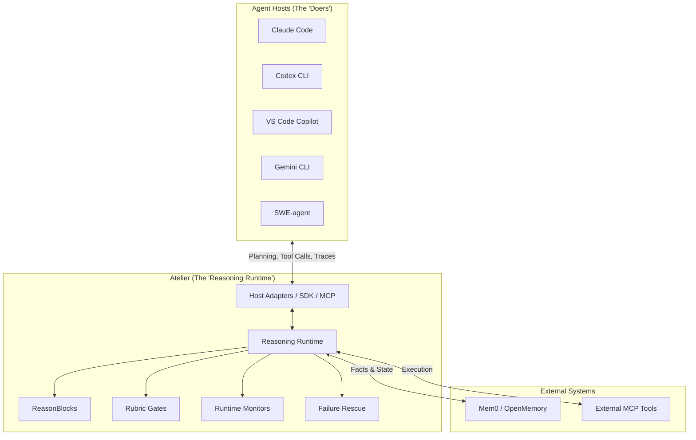

# Atelier Ecosystem Architecture

Atelier sits between Agent Hosts and their environments, acting as a governance and reasoning layer.

## The Reasoning Runtime Layer

## How It Fits Together

1. **Host Adapters**: Native plugins, MCP stdio connections, or direct Python SDK bindings to coding agents.
2. **Stable SDK Layer**: `AtelierClient`, `LocalClient`, `RemoteClient`, and `MCPClient` reuse the existing local runtime, HTTP service, and MCP tools instead of introducing duplicate execution paths.
3. **Atelier Runtime**: Intercepts plans, checks rubrics, manages reasoning context, and monitors execution.
4. **Memory Systems**: Interacts with OpenMemory or Mem0 to pull facts, while Atelier handles the _procedural_ memory (ReasonBlocks).
5. **External MCP Hosts**: Atelier can connect to external domain environments, orchestrating their tools safely behind Rubric gates.
