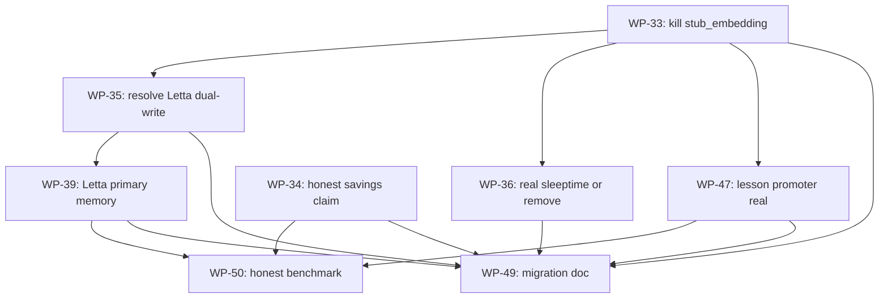

# Atelier V3 — Work-Packets Index

**Status:** Draft v2 · 2026-05-04
**Companion to:** [IMPLEMENTATION_PLAN_V3.md](IMPLEMENTATION_PLAN_V3.md),
[IMPLEMENTATION_PLAN_V3_DATA_MODEL.md](IMPLEMENTATION_PLAN_V3_DATA_MODEL.md),
[V2 INDEX](work-packets/INDEX.md) (for completed history).

V3 supersedes V2 only for new work. The 32 V2 packets stay `done`. **V3 is small** — 8 packets
across 3 phases — because V3 is a cleanup release that fixes specific quality issues found in
the 2026-05-04 audit. It does not introduce a new runtime, an executor, or new dependencies.

---

## Standing rules

1. **Atelier is a tool/data provider.** It does not run an agent loop, does not call LLMs
   (other than the embeddings exception), does not spawn subagents, does not hold API keys.
   Any packet that violates this is rejected at review.
2. **Phase Z is blocking.** No Phase I or Phase J packet may start while any Phase Z packet
   is `ready` or `in_progress`. Cleanup must finish before differentiation work begins.
3. A subagent claims a packet by switching front-matter `status: ready` → `status: in_progress`,
   completes it via the standing Atelier loop + acceptance tests, then sets `status: done`.
4. Never start a packet whose `depends_on` row is not all `done`.
5. **Test layout:** `tests/core` for model/capability tests, `tests/infra` for storage tests,
   `tests/gateway` for CLI/MCP tests, `tests/docs` for documentation gates. No new test
   directories.
6. **No marketing language.** "AI-native", "self-improving", "intelligent", "autonomous" are
   banned in code, packet titles, and PR descriptions until backed by a CI-asserted
   measurement.

## Boundary labels

Every V3 packet declares one of these in its `boundary:` front-matter field:

- **Cleanup** — removes code, retracts a claim, or tightens a contract. May not add new
  subsystems and may not add runtime dependencies.
- **Atelier-core** — hardens an existing capability that Atelier already owns (memory tools,
  lesson pipeline). May not change what Atelier _is_.
- **Migration** — documents or implements V2→V3 transition. May not change runtime behavior.

There is no `OSS-adoption` or `Runtime` label in V3 because V3 does not adopt new runtime
dependencies and does not introduce a runtime.

---

## Phase Z — Truth & cleanup (blocking)

| WP                                         | Title                                                                           | Owner        | Boundary | Depends on | Status |
| ------------------------------------------ | ------------------------------------------------------------------------------- | ------------ | -------- | ---------- | ------ |
| [WP-33](work-packets-v3/WP-33-strip-stub-embedding.md)     | Delete `stub_embedding`; route all callers through `Embedder`                   | atelier:code | Cleanup  | —          | ready  |
| [WP-34](work-packets-v3/WP-34-honest-savings-claim.md)     | Retract or qualify the 81 % savings headline; CI gate against unmeasured claims | atelier:code | Cleanup  | —          | ready  |
| [WP-35](work-packets-v3/WP-35-resolve-letta-dual-write.md) | Resolve `LettaMemoryStore` dual-write — pick one primary backend                | atelier:code | Cleanup  | WP-33      | ready  |
| [WP-36](work-packets-v3/WP-36-sleeptime-honest-or-gone.md) | Real LLM-call sleeptime summarizer OR remove from savings story                 | atelier:code | Cleanup  | WP-33      | ready  |

**Phase Z gate:** all four `done` before any Phase I packet starts.

---

## Phase I — Differentiation fix

Two packets that finish what V2 left half-built. Both depend on Phase Z cleanups.

| WP                                     | Title                                                                                         | Owner        | Boundary     | Depends on | Status |
| -------------------------------------- | --------------------------------------------------------------------------------------------- | ------------ | ------------ | ---------- | ------ |
| [WP-39](work-packets-v3/WP-39-letta-primary-memory.md) | Letta as primary memory backend behind the existing `memory_*` MCP tools (no more dual-write) | atelier:code | Atelier-core | WP-35      | ready  |
| [WP-47](work-packets-v3/WP-47-lesson-promoter-real.md) | Rebuild `LessonPromoter` clustering on real embeddings; hit precision target                  | atelier:code | Atelier-core | WP-33      | ready  |

---

## Phase J — Migration & honesty

| WP                                         | Title                                           | Owner        | Boundary  | Depends on          | Status |
| ------------------------------------------ | ----------------------------------------------- | ------------ | --------- | ------------------- | ------ |
| [WP-49](work-packets-v3/WP-49-v2-to-v3-migration-doc.md)   | V2→V3 migration doc + deprecation matrix        | atelier:code | Migration | WP-33 … WP-47       | ready  |
| [WP-50](work-packets-v3/WP-50-honest-benchmark-publish.md) | Publish V3 honest benchmark; replace 81 % story | atelier:code | Cleanup   | WP-34, WP-39, WP-47 | ready  |

---

## Dependency graph (Mermaid)



---

## Subagent contract

Same as V2 (see V2 INDEX § "Subagent contract") with one V3-specific rule:

**The boundary is enforced.** A V3 packet may not import an LLM client (`anthropic`, `openai`,
`litellm`, etc.) under `src/atelier/`. The single exception is `OpenAIEmbedder` inside
`src/atelier/infra/embeddings/`, used only for `text-embedding-3-small` (a vector lookup, not a
completion). Any packet that opens a new path to an LLM completion API is out of scope and
rejected at review.

When a packet is `done`:

- Update front-matter `status: done`.
- Update this INDEX's status column for that row.
- Record a trace with `agent: "atelier:code"`, `status: "success" | "partial"`,
  `output_summary` containing the WP id.

# Atelier V3 — Implementation Plan

**Status:** Draft v2 · 2026-05-04
**Owner:** Pankaj (root coordinator)
**Audience:** Small subagents (`atelier:code` / `atelier:explore` / `atelier:review`) executing one
atomic work-packet at a time. Read the [V3 work-packets index](work-packets-v3/INDEX.md) for the
dispatch graph.

**Companion docs:**
[IMPLEMENTATION_PLAN_V3_DATA_MODEL.md](IMPLEMENTATION_PLAN_V3_DATA_MODEL.md),
[V2 plan](IMPLEMENTATION_PLAN_V2.md) (for context on what V3 supersedes),
[V2 work-packets](work-packets/INDEX.md).

---

## 0. What V3 is (and is not)

> **Atelier is a tool and data provider that host CLIs call over MCP. It does not run an agent
> loop, does not call LLMs, does not spawn subagents, and does not hold API keys.**

The host CLI (Claude Code, Codex, opencode, Gemini, or a user's own agent) owns:

- the conversational loop;
- model invocation and billing;
- tool dispatch;
- subagent spawning;
- compaction and checkpoint;
- the user's API keys.

Atelier owns:

- ReasonBlocks (procedure store) and rubric gates — surfaced as MCP tools;
- the `memory_*` MCP tools (upsert/get/list/recall/archive);
- the deterministic context-savings tools: `atelier_search_read`, `atelier_batch_edit`,
  `atelier_sql_inspect`, AST-outline-first reads;
- the `atelier_check_plan` advisory and the `atelier_run_rubric_gate` verifier;
- the trace store (`atelier_record_trace`);
- the lesson pipeline that processes traces in the background and surfaces candidates for human
  review.

V3 keeps that boundary unchanged from V2. The MCP tool surface is preserved. What V3 changes is:

1. **Truth.** V2 shipped three things that aren't what they look like — `stub_embedding` is a
   SHA-256 hash dressed as an embedding; the "81 % savings" headline is a hand-written YAML
   constant; the `LettaMemoryStore` is a dual-write proxy, not a Letta-backed store. V3 fixes
   each of these.
2. **Memory backend.** V3 lets a user pick `sqlite` or `letta` as the memory backend behind the
   existing `memory_*` MCP tools, and makes Letta a real primary (not a side-write proxy).
3. **Lesson promoter quality.** The V2 promoter clusters by SHA-hash collisions. V3 rebuilds it
   on real embeddings and hits the precision target that was filed but never met.
4. **Honest benchmark.** V3 replaces the hand-written 81 % with a measured replay benchmark of
   how Atelier's tools change a host's token budget.

V3 introduces no new runtime, no new executor, no new agent framework dependencies, and no new
LLM clients. It is, in a sense, "V2 minus the lies, plus a real Letta backend, plus a real
lesson signal."

---

## 1. Non-goals (hard exclusions)

These are exclusions that V3 enforces in code review and CI. Any packet that violates them is
rejected.

- ❌ **No agent executor inside Atelier.** No `AgentExecutor`, no LangGraph, no Deep Agents,
  no state-machine runtime, no `atelier run <task>` CLI. The host owns the loop.
- ❌ **No LLM calls from Atelier.** The MCP server, the capabilities, the lesson pipeline,
  and any background worker may not import `anthropic`, `openai`, `litellm`, `google.generativeai`,
  `cohere`, `mistralai`, or any other model client. There is one exception, narrowly scoped:
  **embeddings**. The `Embedder` protocol may use `sentence-transformers` (local model, no
  API call) or, optionally, `openai` for `text-embedding-3-small` if the user explicitly enables
  it. Embeddings are not LLM completions; they are vector lookups. Other than embeddings, the
  rule is absolute.
- ❌ **No subagent spawning.** The host's `Agent` tool spawns subagents. Atelier never does.
- ❌ **No checkpoint/resume.** That is the host's responsibility. Atelier's traces are records,
  not resumable state.
- ❌ **No marketing language without a measurement.** "AI-native", "self-improving",
  "intelligent", "autonomous" are banned in code, packet titles, README, and PR descriptions
  until a CI-asserted measurement exists.

---

## 2. The audit findings V3 fixes

The 2026-05-04 internal audit ([summary in this commit's PR description]) found:

| Finding                                                                                                                                                                                      | Affected modules                                                                                                          | V3 packet                                                               |
| -------------------------------------------------------------------------------------------------------------------------------------------------------------------------------------------- | ------------------------------------------------------------------------------------------------------------------------- | ----------------------------------------------------------------------- |
| `stub_embedding` (SHA-256 feature hash) is wired into `LessonPromoter`, archival "hybrid" ranking, and at least 6 other call sites. Any "semantic" claim downstream is broken.               | `infra/storage/vector.py`, `core/capabilities/lesson_promotion/`, `core/capabilities/archival_recall/`                    | **WP-33**                                                               |
| The "81 % savings" headline is computed from hand-written YAML constants; nothing is measured.                                                                                               | `benchmarks/swe/savings_bench.py`, `benchmarks/swe/prompts_11.yaml`, `README.md`, `docs/benchmarks/v2-context-savings.md` | **WP-34** (retract) + **WP-50** (replace with real measurement)         |
| `LettaMemoryStore` dual-writes to Letta and SQLite; reads prefer Letta with SQLite fallback; `insert_passage` and `record_recall` go to SQLite only. The store is not actually Letta-backed. | `infra/memory_bridges/letta_adapter.py`                                                                                   | **WP-35** (decide single primary) + **WP-39** (real Letta-primary path) |
| Sleeptime "summarizer" is template `groupby` + truncation; counts as a savings lever in V2 docs but compresses no meaning.                                                                   | `core/capabilities/context_compression/sleeptime.py`                                                                      | **WP-36**                                                               |
| `LessonPromoter` clusters via SHA-hash fingerprint; precision target `≥ 0.7` was filed but never met.                                                                                        | `core/capabilities/lesson_promotion/capability.py`                                                                        | **WP-47**                                                               |

Everything else V2 shipped — ReasonBlocks, rubric gates, plan-check, rescue, trace recording,
`search_read`, `batch_edit`, `sql_inspect`, AST outline, MCP gateway, frontend pages — is real,
in-scope, and **kept verbatim** by V3. The audit was a quality check on specific subsystems, not
a wholesale verdict.

---

## 3. Architecture (unchanged from V2)

```
                    ┌─────────────────────────────────────────────────────┐
                    │              Agent Host (Claude Code, Codex…)       │
                    │                                                     │
                    │   - Owns the conversational loop                    │
                    │   - Calls LLMs (host's API key)                     │
                    │   - Dispatches tool calls                           │
                    │   - Spawns subagents                                │
                    │   - Owns checkpoint / compaction                    │
                    └───────────────┬─────────────────────────────────────┘
                                    │ MCP stdio  (tool calls + responses)
                    ┌───────────────▼─────────────────────────────────────┐
                    │                  atelier-mcp gateway                │
                    │           (tool surface, identical to V2)           │
                    └──┬──────────────────┬─────────────────────┬─────────┘
                       │                  │                     │
        ┌──────────────▼──────┐   ┌───────▼─────────┐   ┌───────▼─────────┐
        │ ReasonBlock store   │   │ Memory tools    │   │ Lesson pipeline │
        │ + rubric gates      │   │ (memory_*)      │   │ (background)    │
        │ + plan-check        │   │                 │   │                 │
        │ + rescue + trace    │   │ Backend, picked │   │ Reads recorded  │
        │                     │   │ by config:      │   │ traces; embeds; │
        │ + search_read       │   │   sqlite (default)  │ clusters;       │
        │ + batch_edit        │   │   letta (opt-in)│   │ surfaces lesson │
        │ + sql_inspect       │   │                 │   │ candidates for  │
        │ + AST outline       │   │ Embeddings via  │   │ human review.   │
        │                     │   │ sentence-       │   │ No LLM calls.   │
        │                     │   │ transformers    │   │                 │
        └─────────────────────┘   └────────┬────────┘   └─────────────────┘
                                           │
                                  ┌────────▼─────────────────────────┐
                                  │  Storage:                        │
                                  │   SQLite (default, dev)          │
                                  │   Letta sidecar (optional)       │
                                  └──────────────────────────────────┘
```

**No box says "executor". No arrow goes from Atelier to an LLM API.** This is the same
architecture as V2; what V3 fixes is what's _inside_ the boxes.

### 3.1 Backend choice

A single config knob picks the memory backend:

```toml
[memory]
backend = "sqlite"   # default, dev, unit tests
# backend = "letta"  # opt-in: requires Letta server reachable at ATELIER_LETTA_URL
```

The MCP tool surface is identical in both modes. The host doesn't know or care which backend is
in use. (This is what WP-35 commits to and WP-39 implements.)

### 3.2 Embeddings

`Embedder` is the V2 protocol. V3 enforces that **every** embedding call goes through it. The
default backend is `LocalEmbedder` (sentence-transformers, MiniLM-L6-v2, ~80 MB, no API call).
Optional backends:

- `OpenAIEmbedder` (`text-embedding-3-small`) — only when the user explicitly sets
  `OPENAI_API_KEY` and `[embeddings].backend = "openai"` in config.
- `LettaEmbedder` — only when Letta is the memory backend and exposes an embed endpoint.
- `NullEmbedder` — returns `[]`; recall falls back to BM25 only. Used in CI when no embedder
  is available.

`stub_embedding` (the SHA-hash trick) is **deleted** in WP-33. Any reference is a CI failure.

### 3.3 Routing — V2 advisory, kept as-is

Atelier's V2 routing capability (`quality_router/policy.py`, WP-25..28) is an _advisory_ MCP
response inside `atelier_check_plan`. The host reads `routing_advice` and decides what to do —
or ignores it if the host has no per-step model switching. V3 does not change this surface.

If, later, you decide to improve the routing algorithm, that is a separate decision and a
separate packet — not part of V3.

---

## 4. Phasing

V3 is small. 8 packets, 3 phases, ~10 dev-days sequential.

```
Phase Z — Truth & cleanup       WP-33 … WP-36   (4 packets, blocking)
Phase I — Differentiation fix   WP-39, WP-47    (2 packets)
Phase J — Migration & honesty   WP-49, WP-50    (2 packets)
```

### Why Phase Z first

Same reason as in V2: the cleanups unblock honest measurement. Without WP-33, lesson promoter
"precision" is meaningless. Without WP-34, the README is making a claim the code can't back up.
Without WP-35, WP-39 has to deal with data divergence on top of integration. Without WP-36, the
"savings levers" list contains a fake.

### Phase I

Two packets, both honesty-driven:

- **WP-39** implements Letta-as-real-primary for the `memory_*` MCP tools (WP-35 only resolves
  the contradiction; WP-39 makes the chosen path actually work).
- **WP-47** rebuilds `LessonPromoter` clustering on real embeddings and hits the V2 precision
  target.

### Phase J

- **WP-49** documents the V2→V3 transition. The MCP tool surface is unchanged, so most users
  do nothing. The migration doc covers config knobs and deprecation flags.
- **WP-50** publishes the first measured savings benchmark, replacing the retracted 81 % story.

---

## 5. Success metrics

V3's metrics are deliberately fewer than V2's because the runtime is unchanged. We assert only
the things V3 actually fixes.

| Metric                                                                                                         |                              V2 baseline | V3 target | Test                                                                    |
| -------------------------------------------------------------------------------------------------------------- | ---------------------------------------: | --------: | ----------------------------------------------------------------------- |
| `stub_embedding` references in `src/atelier/`                                                                  |                                       8+ |     **0** | grep gate (`tests/infra/test_no_stub_embedding.py`)                     |
| Bare unmeasured percentages in README and benchmark docs                                                       |                                  several |     **0** | doc gate (`tests/docs/test_readme_no_unmeasured_claims.py`)             |
| Letta dual-write code paths                                                                                    |                                  present |     **0** | grep gate + behavioral test                                             |
| Sleeptime "savings" recorded in telemetry without measurement                                                  |                                  present |     **0** | grep / behavioral gate (per WP-36 path chosen)                          |
| `LessonPromoter` precision on 200-trace fixture                                                                |                               unmeasured | **≥ 0.7** | `tests/infra/test_lesson_promotion_precision.py`                        |
| Atelier modules importing `anthropic` / `openai` / `litellm` / model clients (excluding the embeddings module) | n/a (V2 didn't have such imports either) |     **0** | CI grep gate (new in V3 — defends the boundary)                         |
| Honest savings benchmark published with real numbers                                                           |                                       no |       yes | `make bench-savings-honest` produces a `BenchmarkRun` row; doc lists it |

The single hard release gate for V3 is: **every percentage in the README and docs links to a
measurement, and no module under `src/atelier/` (outside the embeddings package) imports a
model client.**

---

## 6. Dependency strategy

V3 adds **zero new runtime dependencies.**

- Letta — already a V2 optional extra (`letta-client>=1.7.12` in the `memory` extra).
- Embeddings — already a V2 optional extra (`sentence-transformers` in the `vector` extra).

Phase Z packets remove code; they do not add deps. Phase I packets reuse the existing extras.
Phase J packets are documentation and benchmark scripts.

---

## 7. Migration strategy

### V2 users

Most users do nothing. V3 keeps every V2 MCP tool name, signature, and return shape.

What changes:

| Concern            | V2 default                                                       | V3 default                                                                          | Action required                                           |
| ------------------ | ---------------------------------------------------------------- | ----------------------------------------------------------------------------------- | --------------------------------------------------------- |
| Memory backend     | implicit dual-write to Letta+SQLite when `ATELIER_LETTA_URL` set | explicit single-primary;`[memory].backend = "sqlite"` if not set                    | nothing for SQLite users; Letta users add one config line |
| `stub_embedding`   | silently used in lesson promoter and ranking                     | deleted; legacy rows flagged `legacy_stub`; back-fill via `atelier reembed` (WP-47) | run `atelier reembed` once after upgrade                  |
| Sleeptime lever    | counted toward "savings" via templates                           | either real (WP-36 path A) or removed (path B)                                      | none; reflected in telemetry only                         |
| 81 % savings claim | in README                                                        | retracted, footnoted as "design target" until WP-50                                 | none                                                      |

### Trace continuity

V3 traces are a strict superset of V2 traces. No trace fields are removed; no fields are
required that V2 didn't have.

---

## 8. How a subagent should consume this plan

1. Open [work-packets-v3/INDEX.md](work-packets-v3/INDEX.md). Pick the lowest-numbered packet
   whose dependencies are all satisfied.
2. **Phase Z is blocking.** No Phase I or J packet may start while a Phase Z packet is `ready`
   or `in_progress`.
3. Read the packet file. Read the V3 plan section it links to. Read any V2 packet it
   supersedes (linked in `supersedes:` front-matter).
4. Run the standing Atelier loop: `atelier_get_reasoning_context` → draft plan →
   `atelier_check_plan` → implement → run packet acceptance tests → `atelier_record_trace`.
5. Mark `status: done` in front-matter and update the V3 INDEX.

Subagents must **not** invent new files outside what a packet specifies, and must **not** add
runtime dependencies. If a packet seems under-specified, raise a comment and stop — do not
improvise scope.

---

## 9. References

### Internal

- [V2 plan](IMPLEMENTATION_PLAN_V2.md) — V3 supersedes this for new work; V2 packets stay
  `done`.
- [V2 INDEX](work-packets/INDEX.md) — the 32-packet history.
- [cost-performance-runtime.md](cost-performance-runtime.md) — V2 routing context, still
  authoritative; V3 makes no changes here.

### External

- [Letta](https://github.com/letta-ai/letta) — Apache-2.0; used as the optional Letta sidecar
  for the `letta` memory backend. Atelier never embeds Letta source.
- sentence-transformers — used by `LocalEmbedder` for the default embedding backend.

V3 does not adopt LangGraph, Deep Agents, LiteLLM, or any other agent-framework dependency.
Those were considered in an earlier draft of this plan and rejected because they would have
required Atelier to call LLMs, which violates the boundary in § 0.

# Atelier V3 — Data Model Deltas

**Status:** Draft v2 · 2026-05-04
**Companion to:** [IMPLEMENTATION_PLAN_V3.md](IMPLEMENTATION_PLAN_V3.md),
[V2 data model](IMPLEMENTATION_PLAN_V2_DATA_MODEL.md).

---

## 0. Posture

V3 inherits the V2 schema verbatim. There are no new tables (other than an optional
`BenchmarkRun` for measured savings), no breaking column changes, and no breaking removals.

V3 changes are:

1. The `embedding` columns must be produced by a real `Embedder` — `stub_embedding` is gone.
2. A small provenance flag (`embedding_provenance`) is added so legacy rows can be reembedded.
3. A `BenchmarkRun` table is added so measured savings results have somewhere to live (replaces
   the hand-written YAML constants).

Everything else stays as V2 specified it.

---

## 1. Delta summary

| Concern                                                                                                               | V2                                      | V3                                                                                     |
| --------------------------------------------------------------------------------------------------------------------- | --------------------------------------- | -------------------------------------------------------------------------------------- |
| `MemoryBlock`, `ArchivalPassage`, `MemoryRecall`, `RunMemoryFrame`, `Trace`, `LessonCandidate`, `ReasonBlock` schemas | as V2                                   | **same as V2 — no field changes**                                                      |
| `archival_passage.embedding`, `lesson_candidate.embedding` columns                                                    | sometimes populated by `stub_embedding` | **must be from `Embedder.embed()`**; V3 fails closed if a SHA-hash artifact is written |
| New optional column `embedding_provenance` on `archival_passage` and `lesson_candidate`                               | n/a                                     | added; legacy rows flagged `legacy_stub`                                               |
| New `BenchmarkRun` table                                                                                              | n/a                                     | added in WP-50 to record measured savings results                                      |
| Deprecated:`infra/storage/vector.py::stub_embedding`                                                                  | present                                 | **deleted in WP-33**                                                                   |
| Deprecated: dual-write code paths in `infra/memory_bridges/letta_adapter.py`                                          | present                                 | **removed in WP-35**                                                                   |

There are no cross-runtime correlation IDs in V3 (the V3 draft v1 had `langgraph_run_id`,
`letta_agent_id`, `litellm_request_id` — those have been removed because Atelier does not run
LangGraph, does not call Letta as an executor, and does not call LiteLLM).

---

## 2. Embedding contract

### 2.1 Rule

Every column named `embedding` (or any equivalent vector field) must be produced by an
implementation of the `Embedder` Protocol from `src/atelier/infra/embeddings/base.py`. The
fallback for unavailable backends is `NullEmbedder`, which writes `[]`. It is **never**
`stub_embedding`.

### 2.2 Enforcement

- **Static.** A CI grep gate (`tests/infra/test_no_stub_embedding.py`) fails if any file under
  `src/atelier/` (excluding `tests/`) imports or calls `stub_embedding`.
- **Runtime.** `archival_passage.embedding`, `lesson_candidate.embedding`, and any future
  `*_embedding` column must satisfy:
  - empty (length 0), OR
  - dimension matches a registered embedder dimension (e.g. 384 for MiniLM, 1536 for
    `text-embedding-3-small`).
    32-byte SHA-hash artifacts (the V2 stub output) violate the dimension check and are
    rejected.

### 2.3 Migration of legacy rows

- A new column `embedding_provenance TEXT DEFAULT 'legacy_stub'` is added on
  `archival_passage` and `lesson_candidate`.
- New rows written via the `Embedder` protocol set this to the embedder class name
  (e.g. `'LocalEmbedder'`, `'OpenAIEmbedder'`).
- Until reembedding is complete, archival recall returns `legacy_stub` rows ranked by BM25
  only; the cosine score is forced to 0 and the recall result metadata surfaces the flag.
- A one-shot CLI `atelier reembed` (added in WP-47) reads legacy rows, calls the configured
  `Embedder`, writes new vectors, and clears the flag.

---

## 3. New: `BenchmarkRun` table

Replaces `benchmarks/swe/prompts_11.yaml` (hand-written constants) with a place to record
measurements.

### 3.1 Schema

```python
class BenchmarkRun(BaseModel):
    id: UUID
    started_at: datetime
    completed_at: datetime | None
    suite: str                  # "savings_replay_v3", future suites
    git_sha: str
    config_fingerprint: str     # SHA of the resolved .atelier/config.toml at run start

    # Per-prompt records live in benchmark_prompt_result table (FK to BenchmarkRun.id)

    # Aggregates, computed at completion
    n_prompts: int
    median_input_tokens_baseline: int | None     # Run A: ATELIER_DISABLE_ALL=1
    median_input_tokens_optimized: int | None    # Run B: defaults
    reduction_pct: float | None                  # (A - B) / A * 100
    notes: str | None
```

### 3.2 The 81 % claim

Until WP-50 publishes the first real `BenchmarkRun`:

- README and docs must either omit the percentage or qualify it as "design target" with a
  footnote linking to the open WP-50.
- `tests/docs/test_readme_no_unmeasured_claims.py` enforces this (gate added in WP-34).

---

## 4. Letta mapping

V3 keeps the V2 Atelier↔Letta type mapping:

- Atelier `MemoryBlock` ↔ Letta `Block` (`label`/`value`/`limit_chars` ↔ `label`/`value`/
  `limit`; `metadata` round-trips).
- Atelier `ArchivalPassage` ↔ Letta `Passage`.

V3 adds Atelier metadata under a stable `atelier_*` namespace inside Letta's `metadata` dict so
round-trip is collision-free:

- `atelier_run_id`
- `atelier_last_recall_at`
- `atelier_dedup_hash`

The mapping is implemented in `src/atelier/infra/memory_bridges/letta_adapter.py` and is
rewritten in WP-39 to be a single-primary path (no dual-write).

---

## 5. ReasonBlock schema — unchanged

V3 makes zero changes to the `ReasonBlock` Pydantic model. The store, retrieval, and review
surfaces are kept verbatim. ReasonBlocks are the part of Atelier with the highest correctness
requirements, and V3 introduces no churn on them.

---

## 6. Deprecation matrix

| Symbol                                                                                      | Status                                | Removed in | Replacement                                                                    |
| ------------------------------------------------------------------------------------------- | ------------------------------------- | ---------- | ------------------------------------------------------------------------------ |
| `infra/storage/vector.py::stub_embedding`                                                   | **deleted** in WP-33                  | V3.0       | `Embedder` protocol with a real backend                                        |
| `infra/memory_bridges/letta_adapter.py` dual-write paths                                    | **removed** in WP-35                  | V3.0       | single-primary backend, picked by `[memory].backend` config                    |
| `core/capabilities/context_compression/sleeptime.py` template implementation                | replaced or removed in WP-36          | V3.0       | per WP-36 decision (real LLM-call summarizer if Letta path; otherwise removed) |
| `benchmarks/swe/prompts_11.yaml` (hand-written savings constants)                           | retracted in WP-34; replaced in WP-50 | V3.0       | `BenchmarkRun` rows from real replay                                           |
| `core/capabilities/lesson_promotion/capability.py::_fingerprint` (string-prefix clustering) | replaced in WP-47                     | V3.0       | cosine clustering over real embeddings                                         |

Each row corresponds to a tracked WP. Each WP has acceptance tests proving the new path works
before the old one is removed.

---

id: WP-33
title: Delete `stub_embedding`; route all callers through the `Embedder` protocol
phase: Z
boundary: Cleanup
owner_agent: atelier:code
depends_on: []
supersedes: []
status: done

---

# WP-33 — Strip `stub_embedding`

## Why

The 2026-05-04 audit found that `LessonPromoter`, the "hybrid" archival ranking, and at least
six other call sites bypass the `Embedder` protocol entirely and call
`infra/storage/vector.py::stub_embedding()` — a SHA-256 feature-hashing trick that returns a
32-byte deterministic vector. It is **not** a semantic embedding. Any clustering, recall, or
ranking that depends on it silently degrades to string-prefix matching with hash collisions.

This is a correctness bug, not a missing feature. Until it is removed, every claim downstream
("semantic recall", "lesson clustering precision", "hybrid ranking") is unverifiable. Phase H
integration packets cannot honestly measure improvement against a baseline that is broken.

**Phase Z is blocking on this packet.** All other V3 work waits.

## Files touched

- **DELETE:** `src/atelier/infra/storage/vector.py::stub_embedding` and any helper that
  exists only to support it.
- **EDIT, in `src/atelier/`:** every file that imports or calls `stub_embedding` — replace with
  the `Embedder` protocol obtained via `make_embedder()` from
  `src/atelier/infra/embeddings/factory.py`.
  - `src/atelier/core/capabilities/lesson_promotion/capability.py`
  - `src/atelier/core/capabilities/archival_recall/ranking.py` (or wherever the cosine path is)
  - any other caller surfaced by `grep -r stub_embedding src/atelier/`
- **EDIT:** `src/atelier/infra/embeddings/factory.py` — ensure `make_embedder()` returns
  `LocalEmbedder` by default when no env override is set, and that `LocalEmbedder` lazy-loads
  sentence-transformers on first call (no import cost at module load).
- **NEW:** `tests/infra/test_no_stub_embedding.py` — CI grep gate; fails if any file under
  `src/atelier/` (excluding `tests/`) imports or calls `stub_embedding`.
- **NEW:** `tests/core/test_embedder_routing.py` — every previously-broken call site
  (LessonPromoter, archival ranking, anything else found) is asserted to call `Embedder.embed()`
  exactly once with the expected text.
- **EDIT:** `src/atelier/infra/storage/sqlite_memory_store.py` — add a runtime
  `CHECK length(embedding) IN (0, 384*8, 1536*8, …)` on `archival_passage.embedding` (per
  data-model § 2.2). Or do equivalent Python-level guard if SQLite CHECK is impractical.
- **EDIT:** `src/atelier/infra/storage/sqlite_memory_store.py` — add `embedding_provenance`
  column on `archival_passage` and `lesson_candidate` (per data-model § 2.3).

## How to execute

1. **Inventory callers first** — do NOT start editing until you have run:

   ```bash
   grep -rn "stub_embedding" src/atelier/
   ```

   Record the full list in the PR description so reviewers can verify nothing is missed.

2. **Replace each caller in the smallest possible diff.** For each call site:
   - Inject an `Embedder` via constructor (preferred) or `make_embedder()` at the call site.
   - Replace `stub_embedding(text)` with `embedder.embed(text)` (note: protocol returns
     `list[float]`; check the existing signature).
   - If the caller currently can't fail (because `stub_embedding` is sync and infallible), wrap
     the new call to handle `EmbedderUnavailable` by falling back to `NullEmbedder` (which writes
     `[]`) and logging at WARNING. Do **not** crash the call site.

3. **Add the legacy provenance column** so existing rows remain readable:
   - Migration: `ALTER TABLE archival_passage ADD COLUMN embedding_provenance TEXT DEFAULT 'legacy_stub'`
   - Same on `lesson_candidate`.
   - New rows written via the Embedder protocol set this to `<embedder_class_name>` (e.g.
     `'LocalEmbedder'`).
   - Recall code: rows with `embedding_provenance='legacy_stub'` get cosine forced to 0 in
     hybrid ranking and a `legacy_stub: true` flag in the recall result metadata.

4. **Delete `stub_embedding`** only after the inventory is empty. Run the grep gate test
   locally first.
5. **Smoke test:** confirm `atelier-mcp` starts, `LessonPromoter.ingest_trace()` runs without
   `stub_embedding`, and archival recall returns rows (even if some are `legacy_stub`).
6. **Document the deferred re-embed** in the WP-47 packet (referenced from the data-model doc).
   This packet does not back-fill old rows — that is WP-47's job.

## Acceptance tests

```bash
cd /home/pankaj/Projects/leanchain/atelier

# 1. The CI grep gate passes (i.e., no more callers).
LOCAL=1 uv run pytest tests/infra/test_no_stub_embedding.py -v

# 2. The Embedder routing tests pass (every call site routes through the protocol).
LOCAL=1 uv run pytest tests/core/test_embedder_routing.py -v

# 3. The full repo's tests still pass with the new wiring.
make verify
```

## Definition of done

- [ ] `grep -rn stub_embedding src/atelier/` returns zero matches (excluding the deletion in the
      diff itself).
- [ ] `tests/infra/test_no_stub_embedding.py` passes (and is wired into `make verify`).
- [ ] `tests/core/test_embedder_routing.py` passes — explicit assertion per known caller.
- [ ] `archival_passage` and `lesson_candidate` carry `embedding_provenance`; legacy rows are
      flagged `legacy_stub`; new rows carry the embedder class name.
- [ ] Hybrid ranking forces cosine to 0 for `legacy_stub` rows; recall response surfaces the
      flag.
- [ ] `make verify` is green.
- [ ] V3 INDEX status updated to `done`. Trace recorded with `output_summary` containing
      "WP-33" and the count of call sites migrated.

---

id: WP-34
title: Retract or qualify the 81 % savings headline; CI gate against unmeasured claims
phase: Z
boundary: Cleanup
owner_agent: atelier:code
depends_on: []
supersedes: [WP-19]
status: done

---

# WP-34 — Honest savings claim

## Why

`benchmarks/swe/savings_bench.py` does not measure anything. It loads
`benchmarks/swe/prompts_11.yaml`, where `naive_input_tokens` and per-lever savings are
hand-written constants. The README's headline "81 % reduction across major models" multiplies
the same hardcoded ratio against a model price list. The "real-world validation" doc in
`docs/benchmarks/` does the same thing. None of it is a measurement.

This is a credibility liability. A user who reads the V2 plan and tries to verify the headline
will find that the test passes only because the YAML constants are tuned to make the assertion
pass. We need to either:

- (a) **Retract** the headline — change the README to "design target", footnote it, and link to
  the open WP-50 ("publish honest benchmark") — **this packet's path**, OR
- (b) **Replace** the headline with a real measurement — that is WP-50's job.

WP-34 is the _retraction_ and _CI gate_ step. WP-50 is the _replacement_ step. They are split
because the retraction must ship in V3.0 unconditionally; the replacement requires the rest of
Phase H + I to be in place.

## Files touched

- **EDIT:** `README.md` — remove or qualify every percentage claim. Each remaining percentage
  must be either:
  - A V3 design target with an explicit "(design target — see WP-50)" footnote, OR
  - A linked measurement from a `BenchmarkRun` row published after WP-50.
    No bare percentages.
- **EDIT:** `docs/benchmarks/v2-context-savings.md` — add a banner at the top:
  > **2026-05-04 correction:** the "81 %" figure on this page is derived from hand-written
  > YAML constants, not a measurement. See [V3 plan § 0](../../docs/architecture/IMPLEMENTATION_PLAN_V3.md)
  > and [WP-34](work-packets-v3/WP-34-honest-savings-claim.md) for the
  > retraction; see [WP-50](work-packets-v3/WP-50-honest-benchmark-publish.md)
  > for the replacement methodology.
  > Do not delete the page (it is referenced from V2 traces).
- **EDIT:** `docs/benchmarks/phase7-2026-04-29.md` — same banner.
- **NEW:** `tests/docs/test_readme_no_unmeasured_claims.py` — CI gate that scans `README.md`
  and `docs/benchmarks/*.md` for percentage tokens (`/\b\d+(\.\d+)?\s*%/`), and fails for any
  that:
  - Lack a footnote or link in the same paragraph pointing to either a `BenchmarkRun` row or a
    "design target" qualifier, AND
  - Are not inside a fenced code block or quoted historical claim block.
- **NEW:** `tests/docs/test_no_hardcoded_savings_yaml.py` — fails if `benchmarks/swe/prompts_11.yaml`
  contains a `reduction_pct` or equivalent constant. The yaml is allowed to define prompts;
  it may not embed answers.
- **EDIT:** `benchmarks/swe/savings_bench.py` — add a header docstring stating that the file
  is _deprecated for measurement_ until WP-50 lands; the existing assertion remains as a
  smoke test but its threshold is reduced from `≥ 50.0` to `≥ 0.0` (i.e., the test now only
  asserts the runner doesn't crash, not that any savings exist).
- **EDIT:** `tests/infra/test_context_savings_50pct.py` — rename to
  `test_context_savings_smoke.py` and reduce the assertion to `result.reduction_pct >= 0.0`.
  Add a docstring linking to WP-50 for the actual measurement.

## How to execute

1. **Inventory every percentage claim** in the codebase first:

   ```bash
   grep -rn -E '[0-9]+(\.[0-9]+)?\s*%' README.md docs/ | grep -v node_modules
   ```

   Record the list in the PR description.

2. **Categorize each one:**
   - "Measured today" — leave alone (probably none exist).
   - "Design target" — qualify with the footnote.
   - "Fictional" (the 81 %) — remove, or convert to design target.

3. **Edit the README.** The most likely fix is replacing the "81 % reduction across major
   models" line with something like:

   > **Context savings** — Atelier ships deterministic context-savings tools
   > (`atelier_search_read`, `atelier_batch_edit`, AST outline-first reads, scoped recall).
   > A measured reduction will be published with V3.0; see
  > [WP-50](work-packets-v3/WP-50-honest-benchmark-publish.md) for
   > methodology. Until then, treat all percentage figures in this README as design targets.

4. **Edit the existing benchmark docs** with the correction banner. Keep the original numbers
   for trace continuity, but mark them clearly.
5. **Add the CI gates.** The two new tests must run as part of `make verify`. Confirm they
   fail before your edits land (to prove the gate works) and pass after.
6. **Reduce the existing 50 % CI gate** to a smoke test. Do not delete it — that would lose the
   harness scaffolding WP-50 will reuse. Just make it honest about what it asserts.

## Acceptance tests

```bash
cd /home/pankaj/Projects/leanchain/atelier

# 1. The new doc gates pass.
LOCAL=1 uv run pytest tests/docs/test_readme_no_unmeasured_claims.py \
                     tests/docs/test_no_hardcoded_savings_yaml.py -v

# 2. The renamed smoke test still runs.
LOCAL=1 uv run pytest tests/infra/test_context_savings_smoke.py -v

# 3. Full verify is green.
make verify

# 4. Manual: open README.md, confirm no bare percentages without a footnote.
```

## Definition of done

- [ ] `README.md` contains zero bare percentage claims; every remaining percentage links to a
      measurement or carries a "(design target)" footnote.
- [ ] `docs/benchmarks/v2-context-savings.md` and `docs/benchmarks/phase7-2026-04-29.md` carry
      the 2026-05-04 correction banner.
- [ ] `tests/docs/test_readme_no_unmeasured_claims.py` is wired into `make verify` and passes.
- [ ] `tests/docs/test_no_hardcoded_savings_yaml.py` is wired into `make verify` and passes.
- [ ] `tests/infra/test_context_savings_smoke.py` (renamed from `*_50pct.py`) asserts only the
      smoke condition.
- [ ] `make verify` green.
- [ ] V3 INDEX status updated. Trace recorded with `output_summary` listing every README
      change and the corrected percentage count.

---

id: WP-35
title: Resolve `LettaMemoryStore` dual-write — pick one primary backend
phase: Z
boundary: Cleanup
owner_agent: atelier:code
depends_on: [WP-33]
supersedes: []
status: done

---

# WP-35 — Resolve LettaMemoryStore dual-write

## Why

The 2026-05-04 audit found that `infra/memory_bridges/letta_adapter.py` is a **dual-write
pass-through wrapper**, not a real Letta-backed store:

- Every `upsert_block` writes to Letta **and** SQLite.
- Reads prefer Letta with SQLite fallback.
- `insert_passage`, `record_recall`, run frames go to SQLite **only**.
- `search_passages` calls Letta archival but `_search_passage_rows` has no pgvector path —
  it does FTS5 with a regex-extracted OR-query.

The result: when Letta is configured, you pay double-write cost for marginal benefit, and the
"Letta-backed" archival is actually SQLite-FTS-backed. This blocks WP-39 ("Letta as primary")
because WP-39 cannot honestly migrate data while two stores diverge.

WP-35 is the _decision_ and _cleanup_. WP-39 is the _implementation_ of the chosen primary.

## Decision (made by this packet)

V3 picks **single-primary** with a config knob:

```toml
[memory]
backend = "letta"   # or "sqlite"
```

- `backend = "letta"`: Letta is read+write primary. SQLite is **not** written to. Reads on
  Letta-unavailable raise `MemorySidecarUnavailable` and the caller decides (typically the MCP
  surface returns an error rather than silently downgrading).
- `backend = "sqlite"`: SQLite is read+write primary. Letta is not consulted. This is the
  default for dev / unit tests / users without a Letta sidecar.

The dual-write path is removed. Period. Two stores of truth is the bug, not the feature.

## Files touched

- **EDIT:** `src/atelier/infra/memory_bridges/letta_adapter.py` — remove every `also_write_sqlite`
  / dual-write code path. The adapter becomes a _pure_ Letta client wrapper. If Letta is
  unavailable, raise `MemorySidecarUnavailable`.
- **EDIT:** `src/atelier/infra/storage/factory.py::make_memory_store()` — read
  `[memory].backend` from config (with env-var override `ATELIER_MEMORY_BACKEND`). Return
  exactly one store. Default `sqlite` if neither config nor env set.
- **EDIT:** `src/atelier/core/capabilities/...` — every caller that used to expect "writes go
  to both stores" needs to be checked. There should be none after this edit.
- **EDIT:** `src/atelier/infra/memory_bridges/letta_adapter.py` — implement a real archival
  search path that calls Letta's archival/recall endpoint. Stop reaching back into SQLite for
  passage rows.
- **NEW:** `tests/infra/test_letta_primary_no_sqlite_writes.py` — with `backend=letta` and a
  mocked Letta sidecar (via `respx`), assert that no rows are written to the SQLite memory
  tables during a full upsert/recall round-trip.
- **NEW:** `tests/infra/test_sqlite_primary_no_letta_calls.py` — with `backend=sqlite` and a
  Letta URL set in env, assert that no Letta HTTP calls are made.
- **EDIT:** `tests/infra/test_letta_adapter_fallback.py` — old V2 test asserted silent
  fallback. V3 asserts explicit error propagation: `MemorySidecarUnavailable` is raised, not
  swallowed.
- **EDIT:** `docs/architecture/IMPLEMENTATION_PLAN_V3_DATA_MODEL.md` — confirm § 7 (Letta
  mapping) is accurate after this packet's changes.
- **NEW:** `docs/internal/engineering/decisions/003-memory-single-primary.md` — short ADR
  recording the decision and trade-offs.

## How to execute

1. **Read `letta_adapter.py` end-to-end** before editing. The dual-write code is interleaved
   with the mapping code; you want to keep the mapping helpers (`map_block_to_letta`,
   `map_letta_to_block`) and remove only the dual-write branches.
2. **Add the config knob.** `make_memory_store()` should:
   - Read `ATELIER_MEMORY_BACKEND` env var first.
   - Fall back to `[memory].backend` in `.atelier/config.toml`.
   - Default to `sqlite`.
   - Log at INFO which backend was selected.

3. **Implement the real Letta archival search.** Use `letta-client`'s archival endpoint
   (check the V3 reference docstring or letta-client README). The cosine + BM25 hybrid math
   stays as a **policy** applied on the result list — the _retrieval_ itself is delegated to
   Letta. (This is consistent with the V3 boundary rule: we don't write a vector store; we
   apply ranking on top of one.)
4. **Remove dual-write.** Every `if self.also_write_sqlite: ...` branch goes. Every
   `record_recall` and `insert_passage` that bypassed Letta gets routed through Letta when
   `backend=letta`.
5. **Update tests.** The two new tests above prove the cleanup is real (no rogue writes /
   no rogue calls). The renamed `test_letta_adapter_fallback.py` proves errors are no longer
   silently swallowed.
6. **Write the ADR.** One page. Decision, alternatives considered (dual-write kept,
   read-from-Letta-write-to-both, this single-primary), why single-primary won.

## Acceptance tests

```bash
cd /home/pankaj/Projects/leanchain/atelier

LOCAL=1 uv run pytest tests/infra/test_letta_primary_no_sqlite_writes.py \
                     tests/infra/test_sqlite_primary_no_letta_calls.py \
                     tests/infra/test_letta_adapter_fallback.py -v

# Smoke: with no Letta env set, default backend is sqlite and works.
ATELIER_MEMORY_BACKEND= LOCAL=1 uv run python -c "from atelier.infra.storage.factory import make_memory_store; print(type(make_memory_store(None)).__name__)"
# Expect: SqliteMemoryStore

# Smoke: with backend=letta and no Letta running, error is explicit (not silent fallback).
ATELIER_MEMORY_BACKEND=letta LOCAL=1 uv run python -c "
from atelier.infra.storage.factory import make_memory_store
try:
    s = make_memory_store(None)
    s.list_pinned()
except Exception as e:
    print(type(e).__name__, str(e)[:80])
"
# Expect: MemorySidecarUnavailable

make verify
```

## Definition of done

- [ ] `letta_adapter.py` contains no dual-write code; every dual-write call site is removed.
- [ ] `make_memory_store()` selects exactly one backend based on config / env.
- [ ] `MemorySidecarUnavailable` raised explicitly when Letta is configured but unavailable;
      no silent fallback.
- [ ] Two new tests prove the no-rogue-writes / no-rogue-calls invariants.
- [ ] ADR `003-memory-single-primary.md` filed.
- [ ] V3 data model doc § 7 confirmed accurate.
- [ ] `make verify` green.
- [ ] V3 INDEX status updated. Trace recorded.

---

id: WP-36
title: Real sleeptime summarizer (Ollama-default, Letta fallback) OR remove from savings story
phase: Z
boundary: Cleanup
owner_agent: atelier:code
depends_on: [WP-33]
supersedes: [WP-09]
status: done

---

# WP-36 — Sleeptime: real or gone

## Why

The 2026-05-04 audit found `core/capabilities/context_compression/sleeptime.py` is ~65 LOC of
template-based grouping:

```python
f"[{n} {kind}s] {last_event.summary[:200]}"
```

The doc admits "deterministic, template-based, no LLM call". This is a glorified `groupby`
followed by string truncation. It cannot compress meaning. Counting it as a context-savings
"lever" overstates what V2 actually does, and inflates the (already-fictional) headline
percentage.

V3 picks one of two paths and commits.

## Decision criterion (updated for V3 with Ollama in scope)

**Atelier may call a small local LLM (Ollama) for internal/background processing.** That
re-opens a "real summarizer" path that doesn't violate the boundary, because the call is
local, free, runs in the background, and is never on the user's hot path.

- **(A) Real summarizer with Ollama-default + Letta fallback** (preferred):
  - **Default sub-path A1:** if Ollama is available locally (detected via the `[smart]`
    extra and `ollama-python` import), call a small local model (e.g. `llama3.2:3b`) to
    summarize old ledger entries. Return the summary.
  - **Fallback sub-path A2:** if Ollama is not available **and** `[memory].backend = "letta"`,
    delegate to Letta's sleeptime endpoint via `letta-client`.
  - **Last-resort sub-path A3:** if neither Ollama nor Letta is configured, raise
    `SleeptimeUnavailable`. Caller decides what to do (the host typically logs and skips
    summarization).
- **(B) Remove the lever:** delete the template summarizer; do not list "sleeptime" as a
  context-savings lever in V3 docs/benchmarks.

**Pick (A).** The new default with Ollama is shippable for everyone with a local model server
running, which is becoming standard in coding-agent setups. Letta-delegated path remains for
users running self-hosted Letta. The only reason to pick (B) over (A) is if for some reason
neither `[smart]` extra nor Letta is part of the project's distribution story — at the time
of this packet's writing, that is not the case.

> **Note on default:** path (A) replaces the V2 template summarizer with a real summary.
> It does not promise "compression" without measurement — telemetry records `input_tokens`
> sent to Ollama and `output_tokens` returned, and the lever's reported saving is _net_
> (`input - output`).

## Files touched

### Path A (default)

- **EDIT:** `pyproject.toml` — add `ollama-python>=0.4.0` to a new optional extra `[smart]`.
- **NEW:** `src/atelier/infra/internal_llm/__init__.py` — namespace for internal-only LLM
  callers. **Atelier-wide rule (added in WP-36):** model-client imports outside this module
  and `infra/embeddings/` are a CI failure (the grep gate from § "Boundary enforcement"
  below).
- **NEW:** `src/atelier/infra/internal_llm/ollama_client.py` — thin wrapper over
  `ollama-python` with:
  - `summarize(text, *, model="llama3.2:3b", max_tokens=256) -> str`
  - `chat(messages, *, model, json_schema=None) -> str | dict` (used by V3.1 packets)
  - Lazy import of `ollama`; raises `OllamaUnavailable` if the extra isn't installed or the
    Ollama server isn't reachable on `OLLAMA_HOST`.
- **EDIT:** `src/atelier/core/capabilities/context_compression/sleeptime.py` — replace the
  template body:
  - Try Ollama via `internal_llm.ollama_client.summarize` (path A1).
  - On `OllamaUnavailable`, if `[memory].backend == "letta"`, delegate to Letta via
    `letta-client` (path A2).
  - Otherwise raise `SleeptimeUnavailable` (path A3).
- **EDIT:** `src/atelier/core/capabilities/telemetry/context_budget.py` — record
  `summarizer_input_tokens` and `summarizer_output_tokens`. Surface
  `atelier_tokens_saved_total{lever="sleeptime"}` as `input - output`. If sleeptime raised,
  do **not** record any saving for that turn.
- **NEW:** `tests/core/test_sleeptime_ollama_default.py` — with a mocked Ollama backend,
  asserts:
  - The summarizer is invoked with a small fixture ledger.
  - The returned summary is shorter than the input by at least N tokens.
  - The metric is recorded net.
- **NEW:** `tests/core/test_sleeptime_letta_fallback.py` — with Ollama unavailable, mocked
  Letta sidecar (`respx`), asserts the call is forwarded to Letta.
- **NEW:** `tests/core/test_sleeptime_unavailable.py` — neither Ollama nor Letta:
  asserts `SleeptimeUnavailable` is raised explicitly (no silent fallback to template).

### Path B (last resort, only if A is rejected)

- Same as the prior version of this packet — delete `sleeptime.py`, remove the lever from
  telemetry, drop callers, ship `tests/infra/test_no_sleeptime_lever.py`.

### Both paths

- **NEW:** `docs/internal/engineering/decisions/004-sleeptime-decision.md` — short ADR
  recording (A) chosen and the Ollama-default rationale.

## Boundary enforcement (added in WP-36, applies repo-wide)

**New CI grep gate:** `tests/infra/test_no_external_llm_clients.py`. Fails if any file under
`src/atelier/` imports any of:

- `anthropic`, `anthropic_bedrock`, `boto3.bedrock_runtime`
- `openai` (allowed only in `infra/embeddings/openai_embedder.py`)
- `litellm`, `cohere`, `mistralai`, `google.generativeai`, `replicate`

`ollama` is allowed **only** inside `src/atelier/infra/internal_llm/`.

This gate codifies the V3 boundary: no model client imports on the user's hot path; Ollama
allowed inside the dedicated internal-processing module only.

## How to execute

1. **Add the `[smart]` extra and `internal_llm` module first.** This is the foundation for
   WP-36, the WP-47 Reflexion step, and all four V3.1 packets that need Ollama.
2. **Implement the three sub-paths** in the new `sleeptime.py`. Sub-path resolution is
   compile-time configurable via `[memory].backend` and runtime-detectable via Ollama
   availability.
3. **Add the boundary CI gate** (`test_no_external_llm_clients.py`). Confirm it fails before
   any code change (because V2 may have residual imports) and passes after.
4. **Update telemetry** to record net savings; never inflate.
5. **Document via the ADR** — record both why path A was chosen and the architectural rule
   (`internal_llm` module is the only LLM-import path outside embeddings).

## Acceptance tests

```bash
cd /home/pankaj/Projects/leanchain/atelier

# Three sub-paths, all mocked:
LOCAL=1 uv run pytest tests/core/test_sleeptime_ollama_default.py \
                     tests/core/test_sleeptime_letta_fallback.py \
                     tests/core/test_sleeptime_unavailable.py -v

# Boundary gate:
LOCAL=1 uv run pytest tests/infra/test_no_external_llm_clients.py -v

# Manual smoke (requires a real local Ollama server):
# ollama serve & ollama pull llama3.2:3b
# LOCAL=1 uv run python -c "
# from atelier.core.capabilities.context_compression.sleeptime import summarize_ledger
# print(summarize_ledger([{'kind':'tool','summary':'long output ...'} for _ in range(50)]))
# "

make verify
```

## Definition of done

- [ ] `[smart]` extra added with `ollama-python` dependency.
- [ ] `src/atelier/infra/internal_llm/` module created with `ollama_client.py`.
- [ ] Sleeptime resolves via A1 → A2 → A3, no silent fall-back to V2 template.
- [ ] Telemetry records net savings; no inflation.
- [ ] Boundary CI gate (`test_no_external_llm_clients.py`) wired into `make verify` and
      passes.
- [ ] ADR `004-sleeptime-decision.md` filed.
- [ ] V3 plan reflects the outcome.
- [ ] `make verify` green.
- [ ] V3 INDEX status updated. Trace recorded.

---

id: WP-39
title: Letta as primary memory backend behind the existing `memory_*` MCP tools (no more dual-write); ship self-hosted Docker setup
phase: I
boundary: Atelier-core
owner_agent: atelier:code
depends_on: [WP-35]
supersedes: []
status: done

---

# WP-39 — Letta primary memory + self-hosted Docker

## Why

WP-35 cleaned up the dual-write contradiction by deciding "single primary, picked by config".
WP-39 actually _implements_ the Letta-primary path so users who configure
`[memory].backend = "letta"` get a real Letta-backed store underneath the **existing**
`memory_*` MCP tools (`memory_upsert_block`, `memory_get_block`, `memory_recall`,
`memory_archive`, etc.).

The host CLI calling those MCP tools sees no difference. The store underneath changes from
"SQLite + dual-writing to Letta" to "Letta only" (or "SQLite only", per WP-35's config knob).

V3 also commits to **self-hosted Letta as the supported deployment**. Atelier ships a
`docker-compose.yml`, an `atelier letta` CLI subcommand for lifecycle management, and a
runbook. We do not depend on Letta Cloud or any hosted service.

Boundary: we do not write a vector store, a passage indexer, an embedding pipeline, or any
agent loop. Atelier maps its `MemoryBlock` / `ArchivalPassage` to Letta's `Block` / `Passage`
and applies its hybrid ranking _policy_ on top of Letta's results. **No LLM is called by
Atelier.** (Letta itself, running in its own Docker container, may call models the user has
configured for it — that's the user's choice and bill, not Atelier's.)

## Files touched

### Letta-primary implementation

- **EDIT:** `src/atelier/infra/memory_bridges/letta_adapter.py` — make every memory operation
  go through Letta when `[memory].backend = "letta"`:
  - `upsert_block` → Letta `client.agents.blocks.modify`
  - `get_block` → Letta `client.agents.blocks.retrieve`
  - `list_pinned` → Letta `client.agents.blocks.list` filtered by tag
  - `insert_passage` → Letta `client.agents.archival.insert`
  - `search_passages` → Letta `client.agents.archival.search`, post-ranked with the existing
    `0.6 * cosine + 0.4 * bm25_norm` policy
  - `record_recall` → Letta passage metadata update + Atelier-side `MemoryRecall` row (kept
    locally for trace continuity)
- **EDIT:** `src/atelier/infra/memory_bridges/letta_adapter.py` — implement metadata
  carry-overs from data-model § 4 (`atelier_run_id`, `atelier_last_recall_at`,
  `atelier_dedup_hash`).
- **EDIT:** `src/atelier/infra/storage/factory.py` — when `backend=letta`, instantiate
  `LettaMemoryStore` from `letta_adapter`; do not also instantiate `SqliteMemoryStore`.

### Self-hosted Docker

- **NEW:** `deploy/letta/docker-compose.yml` — Letta server with persistent volume:
  ```yaml
  services:
    letta:
      image: letta/letta:latest
      ports:
        - "${ATELIER_LETTA_PORT:-8283}:8283"
      environment:
        - LETTA_PG_URI=${LETTA_PG_URI:-} # blank => Letta uses its bundled SQLite
        - OPENAI_API_KEY=${OPENAI_API_KEY:-} # optional; for Letta's internal calls
      volumes:
        - letta_data:/var/letta
      restart: unless-stopped
      healthcheck:
        test: ["CMD-SHELL", "curl -f http://localhost:8283/v1/health || exit 1"]
        interval: 10s
        timeout: 3s
        retries: 5
  volumes:
    letta_data:
  ```
- **NEW:** `deploy/letta/.env.example` — documented env vars (Letta port, Postgres URI if
  the user wants Postgres instead of bundled SQLite, optional API keys for Letta's own LLM
  features).
- **NEW:** `src/atelier/cli/letta.py` — `atelier letta` CLI subcommand group:
  - `atelier letta up` — `docker compose -f deploy/letta/docker-compose.yml up -d`
  - `atelier letta down` — stops and removes the container (preserves the volume)
  - `atelier letta logs [-f]`
  - `atelier letta status` — calls Letta's `/v1/health` and prints status + version
  - `atelier letta reset` — DANGER: removes the volume; requires `--yes` flag
    All commands are thin wrappers; Atelier does not reimplement docker-compose.
- **EDIT:** `pyproject.toml` — register `atelier letta` subcommand entry-point.

### Tests + docs

- **NEW:** `tests/infra/test_letta_primary_round_trip.py` — with a mocked Letta sidecar
  (via `respx`):
  - upsert_block → get_block → list_pinned: round-trips through Letta.
  - insert_passage → search_passages: returns Letta results ranked by Atelier policy.
  - record_recall: writes Atelier-side row AND Letta metadata.
- **NEW:** `tests/infra/test_letta_metadata_carryover.py` — assert Atelier metadata fields
  appear in Letta block/passage metadata.
- **NEW:** `tests/gateway/test_atelier_letta_cli.py` — smoke-test the CLI subcommand stubs
  (mocks `subprocess.run` for the docker calls; asserts the right compose command is built).
- **EDIT:** `tests/infra/test_letta_adapter_fallback.py` — finish the V3 contract: explicit
  `MemorySidecarUnavailable` on Letta down (no silent fallback).
- **NEW:** `docs/internal/engineering/runbooks/letta-self-hosted.md` — full runbook:
  - prerequisites (Docker, Docker Compose v2)
  - one-shell-command bring-up: `atelier letta up`
  - verifying: `atelier letta status` + manual `curl http://localhost:8283/v1/health`
  - configuring Atelier to talk to it: `[memory].backend = "letta"` +
    `ATELIER_LETTA_URL=http://localhost:8283`
  - upgrading Letta image
  - backup / restore of the persistent volume
  - resource expectations (memory, disk, optional Postgres for production scale)
  - what Letta needs in terms of LLM API keys (Letta's internal sleeptime / agent features
    — out of Atelier's scope)

## How to execute

1. **Read `letta-client` README and the V2 `letta_adapter.py`.** WP-35 left a clean slate
   (no dual-write); this packet fills in the real Letta-side calls.
2. **Map types carefully.** Letta `Block.metadata` is a dict; pack the Atelier-specific keys
   under a stable `atelier_*` namespace prefix so we can round-trip without collision.
3. **Apply the ranking policy on the result list, not at retrieval time.** Letta returns a
   ranked list; Atelier may re-rank using the cosine score from Letta's response (if
   exposed) plus its own BM25 over the passage text. If Letta doesn't expose the cosine
   score, the policy degrades to BM25-only and surfaces that in the result metadata.
4. **Keep the local `MemoryRecall` trail.** Even with Letta as primary, Atelier records its
   own recall events for trace continuity. They live in the SQLite `memory_recall` table
   regardless of memory backend.
5. **Ship the Docker setup.** Goal: a user can clone Atelier, run `atelier letta up`, set
   one config line, and have a working Letta-backed memory store within five minutes. The
   runbook is the proof.
6. **Test on a real Docker host.** The CLI smoke tests use mocks; before shipping, manually
   run `atelier letta up`, verify health, hit a memory op, and shut down cleanly.

## Acceptance tests

```bash
cd /home/pankaj/Projects/leanchain/atelier

LOCAL=1 uv run pytest tests/infra/test_letta_primary_round_trip.py \
                     tests/infra/test_letta_metadata_carryover.py \
                     tests/infra/test_letta_adapter_fallback.py \
                     tests/gateway/test_atelier_letta_cli.py -v

# Manual smoke (requires Docker):
LOCAL=1 uv run atelier letta up
LOCAL=1 uv run atelier letta status
# Expect: healthy, version printed.
ATELIER_MEMORY_BACKEND=letta ATELIER_LETTA_URL=http://localhost:8283 \
  LOCAL=1 uv run python -m atelier.cli memory list
LOCAL=1 uv run atelier letta down

make verify
```

## Definition of done

- [ ] All memory operations route through Letta when `backend=letta`; SQLite is not written
      to in that mode.
- [ ] Metadata carry-overs verified by `test_letta_metadata_carryover.py`.
- [ ] Hybrid ranking policy applied on Letta results; degrades cleanly when cosine is absent.
- [ ] `deploy/letta/docker-compose.yml` ships with a healthy default config + persistent
      volume.
- [ ] `atelier letta {up|down|logs|status|reset}` CLI subcommands work; smoke tests pass.
- [ ] Self-hosted runbook published; bring-up validated end-to-end on at least one machine.
- [ ] No new vector store, no new agent loop, no new model invocation written by Atelier
      (boundary check).
- [ ] `make verify` green.
- [ ] V3 INDEX updated. Trace recorded.

---

id: WP-47
title: Rebuild `LessonPromoter` clustering on real embeddings + Reflexion-style lesson body
phase: I
boundary: Atelier-core
owner_agent: atelier:code
depends_on: [WP-33, WP-36]
supersedes: [WP-15]
status: done

---

# WP-47 — Lesson promoter on real embeddings + real lesson bodies

## Why

V2 `LessonPromoter` ingests failed traces, embeds them, clusters them, and proposes
ReasonBlock additions. The pipeline shape is good. Two things are broken:

1. **Clustering signal:** V2 embeds via `stub_embedding` (SHA-256 feature hash), so "semantic
   clustering" is actually string-prefix-fingerprint clustering with hash collisions. The V2
   acceptance test "precision ≥ 0.7 on 200-trace fixture" was filed but never met.
2. **Lesson body quality:** even when clusters form correctly, the lesson body is a
   mechanical concatenation of raw `errors_seen + diff_summary`. It is not procedural
   knowledge; a reviewer has to rewrite it from scratch.

WP-47 fixes both:

- **Clustering** runs on real `Embedder.embed` vectors (now possible after WP-33 deletes
  `stub_embedding`).
- **Lesson body** is generated via a Reflexion-style step (Shinn et al. 2023, Voyager 2023):
  after a cluster forms, an Ollama call drafts a one-paragraph procedural reflection from the
  cluster's traces. The reflection is the candidate's body. Human review gate is unchanged.

WP-47 also adds **Iranti's refinement-pass retry**: when `memory_recall(query)` returns
empty, retry once with a widened query before returning empty. Tiny addition; large impact on
recall miss rate.

## Files touched

### Clustering on real embeddings

- **EDIT:** `src/atelier/core/capabilities/lesson_promotion/capability.py`:
  - Replace `_fingerprint = errors_seen[0][:160]` clustering with cosine-similarity
    clustering on `Embedder.embed(commands_run + errors_seen + diff_summary)`.
  - Cluster threshold: `cosine ≥ 0.85` (config-tunable).
  - Minimum cluster size before promotion: 3 (unchanged from V2).
- **EDIT or NEW:** `src/atelier/core/capabilities/lesson_promotion/clustering.py` —
  extract clustering logic into its own module if not already factored.
- **NEW:** `src/atelier/cli/reembed.py` — `atelier reembed` subcommand:
  - Reads rows from `lesson_candidate` and `archival_passage` where
    `embedding_provenance = 'legacy_stub'`.
  - Calls the configured `Embedder` to compute fresh vectors.
  - Updates rows in batch; clears the legacy flag.
  - Idempotent — safe to re-run.

### Reflexion-style lesson body

- **NEW:** `src/atelier/core/capabilities/lesson_promotion/reflection.py`:
  - `draft_lesson_body(cluster_traces) -> str` that:
    - Composes a stable prompt: _"From these failed attempts and the eventual fix, write a
      one-paragraph procedural reflection: what was the dead-end, what worked, when does
      this apply?"_
    - Calls `internal_llm.ollama_client.summarize` with the cluster's traces.
    - Returns the reflection paragraph.
  - On `OllamaUnavailable`, falls back to the V2 mechanical concatenation (so the lesson
    pipeline still produces _something_, just lower quality). Logs at INFO.
- **EDIT:** `src/atelier/core/capabilities/lesson_promotion/capability.py` — when a cluster
  reaches threshold, call `draft_lesson_body` and store the result as
  `LessonCandidate.body`. Keep the raw cluster traces in `LessonCandidate.evidence` so
  reviewers can audit.

### Refinement-pass retry on empty recall

- **EDIT:** `src/atelier/core/capabilities/archival_recall/...` — when the first pass of
  `memory_recall(query)` returns 0 rows, retry once with:
  - Lowercase + remove punctuation.
  - Drop quoted strings (often noisy in coding errors).
  - Loosen any boolean AND filters to OR.
  - Truncate query to top-3 terms by IDF if available.
    Return whatever the second pass produces. If still empty, return empty.
- Telemetry: record `recall_pass=1|2` and `recall_widened_hits` so we can measure how often
  the retry actually rescues a query.

### Tests + fixture

- **NEW:** `tests/infra/test_lesson_promotion_precision.py` — V2 acceptance test that was
  filed but unmet:
  - Loads a 200-trace fixture (synthetic but representative).
  - Runs the promoter.
  - Asserts `precision ≥ 0.7` (precision = correct_promotions / total_promotions).
- **NEW:** `tests/core/test_lesson_body_reflection.py` — with a mocked Ollama:
  - Asserts `draft_lesson_body` calls Ollama once with the fixed prompt template.
  - Asserts the candidate body is the returned reflection (not raw concatenation).
  - Asserts fallback path on `OllamaUnavailable` produces the V2 concatenation.
- **NEW:** `tests/infra/test_reembed_idempotent.py` — running `atelier reembed` twice
  produces the same result; legacy rows are flagged once and not re-flagged.
- **NEW:** `tests/infra/test_recall_refinement_retry.py` — empty first pass triggers second
  pass with widened query; matches expected hits; non-empty first pass does NOT retry.
- **NEW:** `benchmarks/lesson_promoter/200_trace_fixture.yaml` — labelled fixture.
  Synthetic traces; labels indicate which clusters _should_ form a lesson.

## How to execute

1. **Read the V2 promoter code.** Identify the V2 fingerprint + cluster paths. Note every
   place `stub_embedding` was used — those become `Embedder.embed`.
2. **Rebuild clustering.** Use a simple agglomerative approach:
   - Embed each new candidate.
   - Compute cosine to centroids of existing open clusters.
   - If max cosine ≥ threshold: assign to that cluster.
   - Else: open a new cluster.
   - Promote when cluster size ≥ 3.
     Intentionally simple — V3 is not the place to introduce a new clustering algorithm.

3. **Add Reflexion step.** Goes between "cluster reaches threshold" and "candidate written
   to DB". Failing Ollama is non-fatal; promoter logs and falls back.
4. **Build the fixture honestly.** 200 traces, labelled. Half are bug-fix-on-shopify-publish
   (should cluster). A quarter are pdp-schema variants (should cluster). The rest are noise.
   The fixture is committed to the repo and used in CI.
5. **Implement `atelier reembed`.** Required because legacy rows have unusable
   `legacy_stub` vectors. Without back-fill, the clustering can't see V2 history.
6. **Add refinement-pass retry** to `memory_recall`. Keep it simple — one retry, widened
   query, no recursion.
7. **Hit the precision target.** If the simple clustering doesn't hit `0.7`, tune the
   embedding text composition before reaching for fancier algorithms.

## Acceptance tests

```bash
cd /home/pankaj/Projects/leanchain/atelier

LOCAL=1 uv run pytest tests/infra/test_lesson_promotion_precision.py \
                     tests/core/test_lesson_body_reflection.py \
                     tests/infra/test_reembed_idempotent.py \
                     tests/infra/test_recall_refinement_retry.py -v

# Manual smoke: re-embed a small dataset.
ATELIER_LOCAL_DB=/tmp/test.db LOCAL=1 uv run atelier reembed --dry-run
ATELIER_LOCAL_DB=/tmp/test.db LOCAL=1 uv run atelier reembed

make verify
```

## Definition of done

- [ ] `LessonPromoter` clusters via `Embedder.embed` (no fingerprint string-prefix path).
- [ ] `draft_lesson_body` calls Ollama via `internal_llm.ollama_client`; falls back to V2
      concatenation on `OllamaUnavailable`.
- [ ] `atelier reembed` back-fills legacy rows; idempotent; clears the `legacy_stub` flag.
- [ ] 200-trace fixture committed; precision test passes at ≥ 0.7.
- [ ] `memory_recall` retries with widened query on empty first pass; telemetry records
      `recall_pass` and `recall_widened_hits`.
- [ ] No fingerprint-style clustering remains in `lesson_promotion/`.
- [ ] `make verify` green.
- [ ] V3 INDEX updated. Trace recorded.

---

id: WP-49
title: V2→V3 migration doc + deprecation matrix
phase: J
boundary: Migration
owner_agent: atelier:code
depends_on: [WP-33, WP-34, WP-35, WP-36, WP-39, WP-47]
supersedes: []
status: done

---

# WP-49 — V2→V3 migration doc

## Why

V3 is a small cleanup release. The MCP tool surface is unchanged. Most users do nothing on
upgrade. But three things changed under the hood and one CLI command was added:

1. The memory backend is now picked by an explicit config knob (no more dual-write).
2. `stub_embedding` is gone; legacy embedding rows are flagged `legacy_stub` and need a
   one-time `atelier reembed` to be searchable again.
3. The sleeptime "lever" was either replaced with a real summarizer or removed (per WP-36).
4. The 81 % savings headline is retracted (WP-34) and replaced with a measured number (WP-50).

WP-49 collects this into a single migration doc + deprecation matrix that a V2 user can scan
and act on in five minutes. It is also a self-audit: if the doc is incomplete, the test gate
catches it.

## Files touched

- **NEW:** `docs/migrations/v2-to-v3.md` — the migration doc itself.
- **NEW:** `docs/migrations/v2-to-v3-deprecation-matrix.md` — every removed/changed symbol
  with its replacement.
- **EDIT:** `README.md` — top-of-readme link to the migration doc; "If you used V2, read
  this" callout.
- **EDIT:** `CHANGELOG.md` — V3.0 entry referencing the migration doc.
- **NEW:** `tests/docs/test_migration_doc_completeness.py` — programmatic check that every
  symbol marked `deprecated` (Pydantic warning, docstring directive, removed export) in the
  V3 codebase has a matching row in the deprecation matrix.

## How to execute

1. **Walk the codebase for `deprecated` markers.** Pydantic deprecation warnings, docstring
   `.. deprecated::` directives, removed exports, removed CLI flags — collect them all.
2. **Cross-reference V3 plan § 2 (audit findings) and data-model § 6 (deprecation matrix).**
   Every entry there must have a row in the migration doc with:
   - Symbol / file path
   - V2 behavior (one line)
   - V3 behavior (one line)
   - Migration step for an existing user (one line)
   - WP that did it

3. **Write the migration doc.** Structure:
   - **Quick summary** — "Most users do nothing." (Because the MCP surface is preserved.)
   - **What stays the same** — Atelier is still a tool/data provider; the host CLI still owns
     the loop; every V2 MCP tool name, signature, return shape, ReasonBlock schema, trace
     shape are preserved.
   - **What changes** — three items: memory backend config knob, embedding back-fill,
     sleeptime telemetry, savings headline.
   - **Step-by-step:**
     - SQLite users: do nothing on upgrade. Optionally run `atelier reembed` to back-fill
       legacy rows so archival recall recovers cosine ranking on V2 history.
     - Letta users: add `[memory].backend = "letta"` to `.atelier/config.toml` (or set
       `ATELIER_MEMORY_BACKEND=letta`). Confirm `ATELIER_LETTA_URL` is set. Run
       `atelier reembed` if you want V2 archival rows to participate in cosine ranking.
   - **Deprecation matrix** — link to the table doc.
   - **Rollback** — V3 with `[memory].backend = "sqlite"` is V2-equivalent for memory.
     Reverting `stub_embedding` is not supported (it was incorrect); recall continues working
     via BM25 if no embedder is configured.

4. **Cross-link.** README, CHANGELOG, and migration doc all reference each other.
5. **Run the completeness test.** It must catch any deprecation that didn't make it into the
   matrix.

## Acceptance tests

```bash
cd /home/pankaj/Projects/leanchain/atelier

LOCAL=1 uv run pytest tests/docs/test_migration_doc_completeness.py -v

# Manual review:
# - Open docs/migrations/v2-to-v3.md, verify it walks a real user through the upgrade in
#   under 5 minutes.
# - Open the deprecation matrix, verify every WP-33..47 deprecation has a row.

make verify
```

## Definition of done

- [ ] Migration doc published; covers stay-same / changes / step-by-step / rollback.
- [ ] Deprecation matrix doc published; one row per deprecated symbol, linked to its WP.
- [ ] README and CHANGELOG cross-link.
- [ ] `test_migration_doc_completeness.py` passes (every codebase deprecation has a matrix
      row).
- [ ] Doc explicitly states "Atelier does not run an agent loop and does not call LLMs;
      the host CLI does." — so future readers don't repeat the V3-draft-v1 confusion.
- [ ] `make verify` green.
- [ ] V3 INDEX updated. Trace recorded.

---

id: WP-50
title: Publish V3 honest benchmark; replace the 81 % story
phase: J
boundary: Cleanup
owner_agent: atelier:code
depends_on: [WP-34, WP-39, WP-47]
supersedes: [WP-19]
status: done

---

# WP-50 — Honest benchmark publication

## Why

WP-34 retracted the 81 % savings headline and gated the README against unmeasured claims.
WP-50 _replaces_ it with a real measurement of how much Atelier's MCP tools change a host's
token budget on a fixed corpus of tasks.

**Atelier does not run the benchmark by executing tasks itself.** Atelier is a tool/data
provider; it does not call LLMs. The benchmark is run by a _host harness_ — a small Python
script that simulates a host CLI's tool dispatch — using a deterministic mocked LLM over a
recorded transcript corpus. Atelier's MCP tools are dispatched by the harness exactly as a
real host would dispatch them.

Methodology:

- Record a corpus of ≥ 50 transcripts of host-driven tasks (bug fix, refactor, schema
  migration, multi-file edit, search, summarize, doc edit, etc.). Each transcript is the
  _recorded sequence of tool calls and responses_ that a real host CLI made when solving
  that task. The corpus is committed to the repo; no production data is used.
- Re-play each transcript under two configurations:
  - **Baseline (Run A):** every Atelier tool call is replaced with the host-native equivalent
    (`grep` instead of `atelier_search_read`, sequential `Edit` instead of
    `atelier_batch_edit`, full file reads instead of AST outline). The mocked LLM consumes
    the resulting tool outputs and produces the same final response.
  - **V3 (Run B):** every Atelier tool call goes through Atelier's MCP server normally.
- Compare total input tokens consumed by the mocked LLM, total tool round-trips, and final
  output. Compute `reduction_pct = (A.input_tokens - B.input_tokens) / A.input_tokens * 100`.
- Publish the result and a per-lever attribution.

## Files touched

- **NEW:** `benchmarks/swe/replay_corpus/` — directory of ≥ 50 recorded host-task transcripts
  (JSONL). Each transcript has: task description, ordered tool-call/response pairs (with both
  Atelier and host-native variants), final output. Synthetic but realistic; no PII.
- **NEW:** `benchmarks/swe/savings_replay.py` — the V3 replay harness:
  - Loads the replay corpus.
  - For each transcript, runs Run A (host-native tools only) and Run B (Atelier MCP tools
    where the recorded transcript used them) using a deterministic mocked LLM.
  - Counts input tokens (via `tiktoken` or equivalent) on each side.
  - Writes a `BenchmarkRun` row + per-prompt rows to the benchmark DB.
  - Outputs JSON summary: median reduction %, per-lever attribution, per-prompt table.
- **EDIT:** `Makefile` — add `bench-savings-honest` target.
- **NEW:** `tests/infra/test_savings_replay.py` — CI gate:
  - Asserts the harness completes without error on the full corpus.
  - Asserts the recorded `BenchmarkRun` row has `reduction_pct` (any value, no threshold).
  - Asserts no regression vs. the previous `BenchmarkRun` of the same suite — `reduction_pct`
    must not drop by more than 5 % from the prior baseline.
- **NEW:** `docs/benchmarks/v3-honest-savings.md` — the published results doc:
  - Methodology in detail (including the explicit statement: "Atelier does not call LLMs;
    the harness does, with a mocked deterministic provider, simulating a host CLI's tool
    dispatch loop").
  - Per-lever attribution from the replay (real, not hand-written).
  - Per-prompt table.
  - Replay results published as a CSV alongside the doc.
  - Honest discussion of confounders and limitations.
- **EDIT:** `README.md` — replace the (already-retracted-by-WP-34) headline with the
  measured number from the latest `BenchmarkRun`. Footnote links to the doc and CSV.
- **EDIT:** `docs/benchmarks/v2-context-savings.md` — extend the WP-34 banner with the
  WP-50 link.

## How to execute

1. **Build the replay corpus first.** This is the hardest part. A corpus that:
   - Is large enough to be representative (≥ 50 tasks across the categories above).
   - Is deterministic — the mocked LLM produces the same response for the same prompt.
   - Includes both host-native-tool and Atelier-tool variants for each tool call so Run A
     and Run B are directly comparable.
   - Carries no PII or production data — synthetic seeds only.
   - Is committed to the repo; the corpus version is bumped when the corpus changes.

2. **Implement the harness.** Critical contract: **the harness simulates a host CLI's tool
   dispatch.** It calls Atelier MCP tools the same way Claude Code or Codex would. The
   harness reads the recorded transcript, replays the LLM responses, dispatches the tool
   calls, and counts tokens. Atelier itself never makes an LLM call.
3. **Persist results in `BenchmarkRun`.** Per data-model § 3. Per-prompt rows live in a
   `benchmark_prompt_result` table (FK to BenchmarkRun.id).
4. **Publish honestly.**
   - The doc shows real numbers from a real run.
   - If the measured reduction is 38 % rather than 81 %, that's the headline.
   - If a "lever" shows zero or negative attribution, document it (and consider proposing a
     follow-up packet to deprecate it).

5. **Set the no-regression gate.** Future PRs cannot land if `reduction_pct` drops by more
   than 5 % vs. the prior measured baseline. This replaces V2's fictional `≥ 50 %`
   assertion with an honest "no regression" guardrail.

## Acceptance tests

```bash
cd /home/pankaj/Projects/leanchain/atelier

LOCAL=1 uv run pytest tests/infra/test_savings_replay.py -v

make bench-savings-honest | tee /tmp/savings.json
python -c "
import json
r = json.load(open('/tmp/savings.json'))
assert 'reduction_pct' in r and isinstance(r['reduction_pct'], (int, float))
print('measured reduction:', r['reduction_pct'])
"

make verify
```

## Definition of done

- [ ] Replay corpus committed (≥ 50 host-task transcripts, deterministic, no PII).
- [ ] `bench-savings-honest` Makefile target produces a `BenchmarkRun` row.
- [ ] `docs/benchmarks/v3-honest-savings.md` published with real numbers, per-lever
      attribution, methodology, limitations.
- [ ] Doc explicitly notes that the harness simulates a host CLI's loop and that Atelier
      itself does not call any LLM.
- [ ] README headline replaced with the measured number; links to doc and CSV.
- [ ] No-regression CI gate active (5 % drop budget).
- [ ] WP-34's banner on V2 benchmark docs extended with a link to this packet's published
      results.
- [ ] `make verify` green.
- [ ] V3 INDEX updated. Trace recorded with the measured `reduction_pct`.

---

id: WP-V3.1-A
title: Threshold-triggered tool-output compaction (`atelier_compact_tool_output`)
phase: V3.1
boundary: Atelier-core
owner_agent: atelier:code
depends_on: [WP-33, WP-34, WP-35, WP-36, WP-39, WP-47, WP-49, WP-50]
supersedes: []
status: done

---

# WP-V3.1-A — `atelier_compact_tool_output`

## Why

Bloated tool outputs are the largest single token sink in long coding sessions: full file
reads, verbose `grep` results, multi-page shell outputs, dense SQL result sets. The host's
premium LLM uses 5 % of these and wastes context on the rest.

V3.1-A ships a **threshold-triggered**, **opt-in**, **three-method** compaction MCP tool
that the host can call (or wire into a `PostToolUse` hook) to compress big outputs before
they reach the main LLM, with explicit recovery hints so nothing is lost forever.

This packet absorbs three earlier candidates that are all special cases of the same idea:

- **Stale-output sweeper** (ReasonBlocks-style): becomes the deterministic "drop or stub
  rarely-cited outputs" path.
- **SR2 compaction rule DSL + recovery hints**: becomes the per-content-type deterministic
  truncation strategy.
- **Cline duplicate-content collapsing**: becomes the deterministic "same file twice in
  trajectory → replace older with pointer" strategy.
- **Ollama-summarization at threshold**: becomes the high-budget summary method, gated to
  outputs above a size threshold so latency cost is amortized.

## Files touched

### MCP tool

- **NEW:** `src/atelier/core/capabilities/tool_supervision/compact_output.py` — the
  capability:
  - `compact(content, content_type, budget_tokens) -> CompactResult` per signature below.
  - Three-method gate by size:
    - `< 500 tokens`: `passthrough` — return content unchanged. No work done.
    - `500–2000 tokens`: `deterministic_truncate` — content-type-specific deterministic
      compression (see § "Deterministic strategies").
    - `> 2000 tokens`: `ollama_summary` — call `internal_llm.ollama_client.summarize` with
      explicit `budget_tokens`. On `OllamaUnavailable`, downgrade to
      `deterministic_truncate` (so the tool always returns _something_).
  - `CompactResult` Pydantic model:
    ```python
    class CompactResult(BaseModel):
        compacted: str
        original_tokens: int
        compacted_tokens: int
        recovery_hint: str          # how the host can re-fetch full content
        method: Literal["passthrough", "deterministic_truncate", "ollama_summary"]
        content_type: str
    ```
- **NEW:** `src/atelier/core/capabilities/tool_supervision/compact_strategies/` — one file
  per content type:
  - `file.py`: outline-first (reuses V2 `python_ast`); collapse duplicate occurrences in
    trajectory if `trajectory_files` arg passed.
  - `grep.py`: cluster hits by file; keep first 3 hits per file + count of remainder.
  - `bash.py`: keep stderr fully; truncate stdout to first/last K lines + `… (N lines elided) …`. Recovery hint includes the exact rerun command if known.
  - `tool_output.py`: schema-and-sample for JSON/structured outputs (per SR2's pattern);
    raw-text fallback otherwise.
- **EDIT:** `src/atelier/gateway/mcp_server.py` — register
  `atelier_compact_tool_output(content, content_type, budget_tokens)` MCP tool.

### Claude Code PostToolUse hook

- **NEW:** `integrations/claude/plugin/hooks/post_tool_use_compact.py` — a Claude Code
  `PostToolUse` hook script:
  - Reads the just-finished tool's output from the hook's stdin payload.
  - If `len(output_tokens) > threshold`, calls `atelier_compact_tool_output` via MCP and
    returns the compacted output to be substituted in conversation.
  - Otherwise passthrough.
  - Configurable threshold via `.atelier/config.toml [compact].threshold_tokens`.
- **EDIT:** `integrations/claude/plugin/settings.json.example` — wire the hook in. The
  user opts in by adding the hook to their own `settings.json`; we don't auto-install.
- **NEW:** `integrations/claude/plugin/hooks/README.md` — documents the hook, recovery hint
  pattern, opt-in instructions.

### Telemetry

- **EDIT:** `src/atelier/core/capabilities/telemetry/context_budget.py` — record
  `compact_method` and per-method `tokens_in` / `tokens_out` per call. Surface
  `atelier_tokens_saved_total{lever="compact_tool_output", method=...}`.

### Tests

- **NEW:** `tests/core/test_compact_passthrough.py` — small inputs return unchanged.
- **NEW:** `tests/core/test_compact_deterministic_strategies.py` — one test per content
  type; assert deterministic output for fixed inputs.
- **NEW:** `tests/core/test_compact_ollama_summary.py` — with mocked Ollama, large input
  → calls Ollama with budget; recovery hint present.
- **NEW:** `tests/core/test_compact_ollama_unavailable_falls_back.py` — Ollama raises;
  result method is `deterministic_truncate`, not crash.
- **NEW:** `tests/gateway/test_post_tool_use_hook.py` — hook script smoke test with mocked
  MCP transport.

## Deterministic strategies (cheat sheet)

| `content_type` | Strategy at 500-2000 tokens                                                                                                                 |
| -------------- | ------------------------------------------------------------------------------------------------------------------------------------------- |
| `file`         | AST outline (V2 capability); if same file appears earlier in `trajectory_files`, replace with `[file X already read at step N — see above]` |
| `grep`         | Group hits by file; keep first 3 per file +`... and 17 more in foo.py`                                                                      |
| `bash`         | Full stderr; first 50 + last 50 lines of stdout with `… (X lines elided) …`                                                                 |
| `tool_output`  | JSON schema + 1-2 representative items +`len(items)` summary                                                                                |
| `unknown`      | Truncate to first/last K characters with elision marker                                                                                     |

Recovery hint always includes: how to re-fetch the original (offset/limit args, full path,
rerun command, or `query` to repeat). Format consistent across strategies so an agent prompt
can reliably parse it.

## How to execute

1. **Build the deterministic strategies first.** Five small modules; each is < 100 LOC.
   Test them in isolation.
2. **Add the dispatch / threshold gate.** This is the main `compact()` function; trivial
   over the strategies.
3. **Add the Ollama path.** Reuses `internal_llm.ollama_client.summarize` from WP-36.
   Important: **always include the recovery hint in the Ollama prompt** so the summary
   doesn't hide essential structure.
4. **Register the MCP tool** with strict input validation (max content length, allowed
   content types).
5. **Build the Claude Code hook.** Smoke-test on a real Claude Code session with a long
   `Read` output; confirm the substitution lands and recovery hint appears.
6. **Wire telemetry.** The `lever="compact_tool_output"` line goes into the WP-50 honest
   benchmark — finally, a measured-not-claimed savings number.

## Acceptance tests

```bash
cd /home/pankaj/Projects/leanchain/atelier

LOCAL=1 uv run pytest tests/core/test_compact_passthrough.py \
                     tests/core/test_compact_deterministic_strategies.py \
                     tests/core/test_compact_ollama_summary.py \
                     tests/core/test_compact_ollama_unavailable_falls_back.py \
                     tests/gateway/test_post_tool_use_hook.py -v

# Manual smoke:
LOCAL=1 uv run python -c "
from atelier.core.capabilities.tool_supervision.compact_output import compact
r = compact(content=open('src/atelier/cli/__init__.py').read(),
            content_type='file', budget_tokens=400)
print(r.method, r.original_tokens, '->', r.compacted_tokens)
print('---'); print(r.compacted[:500]); print('---'); print('hint:', r.recovery_hint)
"

make verify
```

## Definition of done

- [ ] `atelier_compact_tool_output` MCP tool registered; three methods route correctly by
      size threshold.
- [ ] Five deterministic strategies implemented and tested.
- [ ] Ollama-summary path goes through `internal_llm.ollama_client`; never violates
      boundary.
- [ ] Recovery hints present and parseable on every non-passthrough result.
- [ ] Claude Code PostToolUse hook script ships; opt-in via settings.json snippet.
- [ ] Telemetry surfaces per-method savings.
- [ ] `make verify` green.
- [ ] V3 INDEX (V3.1 section) updated. Trace recorded.

---

id: WP-V3.1-B
title: PageRank repo map (Aider-style) as `atelier_repo_map` MCP tool
phase: V3.1
boundary: Atelier-core
owner_agent: atelier:code
depends_on: [WP-33, WP-34, WP-35, WP-36, WP-39, WP-47, WP-49, WP-50]
supersedes: []
status: done

---

# WP-V3.1-B — PageRank repo map

## Why

V2 ships `atelier_search_read` (grep + AST outline + token counting). It answers "where is
this string?" well. It does not answer **"what code matters for this task?"** Aider's
PageRank repo map does — and it's fully deterministic, MIT-licensed, and well-documented.

The technique:

1. Walk the repo with **tree-sitter**; emit tags classifying each symbol as a _definition_
   or a _reference_.
2. Build a directed graph: edges from files that _reference_ a symbol to files that
   _define_ it. Weights account for symbol frequency.
3. Run **personalized PageRank** seeded by the files currently in the trace's working set
   (or supplied by the host).
4. Binary-search the top-N tags to fit a token budget — return a budgeted, ranked outline of
   "the code that matters here".

This is the deterministic algorithm Aider has been refining for 18+ months. It directly
beats grep+outline for repo navigation: grep finds _where_ a name appears, PageRank finds
_what is most relevant given where you are_.

Side effect: forces tree-sitter for languages beyond Python. V2's AST outline only handles
Python (via stdlib `ast`). V3.1-B brings JS/TS/Go/Rust along for the ride.

## Files touched

### Tree-sitter foundation

- **EDIT:** `pyproject.toml` — add `tree-sitter`, `tree-sitter-languages`, `networkx` to a
  new optional extra `[repo-map]`.
- **NEW:** `src/atelier/infra/tree_sitter/__init__.py` — namespace.
- **NEW:** `src/atelier/infra/tree_sitter/tags.py`:
  - `extract_tags(file_path, language) -> list[Tag]` where `Tag` carries (name, kind,
    file, line, byte_range).
  - Per-language tags.scm queries (steal Aider's exact queries — they're MIT-licensed and
    battle-tested). Languages: Python, JS, TS, Go, Rust at minimum.
- **NEW:** `src/atelier/infra/tree_sitter/queries/` — one `.scm` file per language.

### Repo map capability

- **NEW:** `src/atelier/core/capabilities/repo_map/__init__.py`
- **NEW:** `src/atelier/core/capabilities/repo_map/graph.py`:
  - `build_reference_graph(repo_root, files) -> nx.DiGraph` —
    walks repo, extracts tags, builds graph (definition_file ← reference_file edges).
  - Skips `.gitignore`-d paths, `node_modules`, build artifacts.
  - Caches per-file tag extraction by file mtime + content hash (reuse V2 cache pattern
    from `search_read`).
- **NEW:** `src/atelier/core/capabilities/repo_map/pagerank.py`:
  - `personalized_pagerank(graph, seed_files, alpha=0.85) -> dict[str, float]` — uses
    `networkx.pagerank` with `personalization` keyed by `seed_files`.
- **NEW:** `src/atelier/core/capabilities/repo_map/budget.py`:
  - `fit_to_budget(ranked_tags, budget_tokens) -> list[Tag]` — binary-searches the largest
    prefix of ranked tags whose serialized outline fits the budget. Uses tiktoken (already
    a V2 dep).
- **NEW:** `src/atelier/core/capabilities/repo_map/render.py`:
  - `render_outline(tags) -> str` — produces Aider-style repo map output (file headers,
    indented signatures, line numbers).
- **EDIT:** `src/atelier/gateway/mcp_server.py` — register MCP tool:
  ```python
  atelier_repo_map(
      seed_files: list[str],
      budget_tokens: int = 2000,
      languages: list[str] | None = None,  # default: detect from extensions
      include_globs: list[str] | None = None,
      exclude_globs: list[str] | None = None,
  ) -> RepoMapResult
  ```

### Tests + benchmark

- **NEW:** `tests/infra/test_tree_sitter_tags.py` — extract tags from fixture files (Python,
  JS, TS, Go, Rust); assert expected tags found.
- **NEW:** `tests/core/test_repo_map_graph.py` — build reference graph from a small fixture
  repo; assert expected edges.
- **NEW:** `tests/core/test_repo_map_pagerank.py` — personalized PageRank with two
  different seed sets; assert ranking shifts as expected.
- **NEW:** `tests/core/test_repo_map_budget.py` — binary search lands within budget;
  rank order preserved.
- **NEW:** `tests/gateway/test_atelier_repo_map_e2e.py` — MCP smoke test on a fixture repo
  (committed under `tests/fixtures/repo_map/`).

### Docs

- **NEW:** `docs/host-integrations/repo-map.md` — when to use `atelier_repo_map` vs.
  `atelier_search_read` (this is the comparison from the "Why" section, written for users).

## How to execute

1. **Get tree-sitter wired up first.** This is the biggest unknown — multi-language tag
   extraction with the right `.scm` queries. Steal Aider's queries verbatim (MIT). Test
   tag extraction in isolation before touching graph code.
2. **Build the graph.** Use `nx.DiGraph` with edge weights = `(num_references_to_symbol)`.
   Cache aggressively — re-extracting tags on every call would be slow.
3. **Personalized PageRank.** `networkx.pagerank` accepts a `personalization` kwarg that
   biases the random walk toward seed files. Use `alpha=0.85` (standard).
4. **Budget fitting.** Tiktoken count of the rendered outline; binary-search the prefix
   length that fits.
5. **Compare against `search_read`** on a real repo. The test fixture should show that for a
   "what files matter for the auth flow?" task, repo_map produces a more focused outline
   than grep would.

## Boundary check

**No LLM is called.** No Ollama, no internal_llm imports. Pure deterministic graph
algorithm. This is V3.1's only fully-deterministic packet — adoption gate should be
correspondingly low.

## Acceptance tests

```bash
cd /home/pankaj/Projects/leanchain/atelier

LOCAL=1 uv pip install -e ".[repo-map]"

LOCAL=1 uv run pytest tests/infra/test_tree_sitter_tags.py \
                     tests/core/test_repo_map_graph.py \
                     tests/core/test_repo_map_pagerank.py \
                     tests/core/test_repo_map_budget.py \
                     tests/gateway/test_atelier_repo_map_e2e.py -v

# Manual smoke against this repo:
LOCAL=1 uv run python -c "
from atelier.core.capabilities.repo_map import build_repo_map
print(build_repo_map(seed_files=['src/atelier/gateway/mcp_server.py'], budget_tokens=1500))
"

make verify
```

## Definition of done

- [ ] Tree-sitter wired for Python, JS, TS, Go, Rust; tag extraction tested per language.
- [ ] Reference graph + personalized PageRank implemented; tests pass.
- [ ] Budget fit via binary search; never exceeds `budget_tokens` ± tiktoken counting
      tolerance.
- [ ] `atelier_repo_map` MCP tool registered; e2e smoke test green.
- [ ] No LLM client imports anywhere in repo_map/ or tree_sitter/ (boundary check).
- [ ] Doc published comparing repo_map vs. search_read.
- [ ] `make verify` green.
- [ ] V3 INDEX (V3.1 section) updated. Trace recorded.

---

id: WP-V3.1-C
title: Sleep-time trace-consolidation worker (Letta-style background process)
phase: V3.1
boundary: Atelier-core
owner_agent: atelier:code
depends_on: [WP-V3.1-A, WP-47]
supersedes: []
status: done

---

# WP-V3.1-C — Sleep-time trace consolidation

## Why

Atelier's ReasonBlock store, lesson candidates, and memory blocks accumulate over time. V2
had no consolidation: stale lessons stay stale, near-duplicates accumulate, low-confidence
entries hang around forever, and the store gradually becomes a junkyard a reviewer
can't keep up with.

Letta solves this with a "sleep-time agent" — a background worker that runs on idle, calls
a small LLM to identify near-duplicates and outdated entries, and proposes consolidations
for human review. We adopt the **pattern**, not the code: a deterministic-where-possible,
Ollama-powered-where-helpful background process.

## Files touched

### Worker

- **NEW:** `src/atelier/core/capabilities/consolidation/__init__.py`
- **NEW:** `src/atelier/core/capabilities/consolidation/worker.py`:
  - `consolidate(*, since: timedelta, dry_run: bool = False) -> ConsolidationReport` —
    main entry point.
  - Pipeline:
    1. Load recent traces, lesson candidates, ReasonBlocks (filtered by `since`).
    2. **Deterministic pass:** find near-duplicate ReasonBlocks via cosine similarity ≥
       0.95 on their embedded body. Group as duplicate clusters.
    3. **Deterministic pass:** flag lesson candidates whose `last_seen_at` is older than
       180 days AND whose cluster has not grown in 90 days as `stale_candidate`.
    4. **Internal-LLM pass (Ollama):** for each duplicate cluster, ask Ollama:
       _"These N ReasonBlocks describe similar procedures. Are they truly duplicates? If
       so, draft a consolidated version that subsumes all. If not, list which are
       distinct."_
    5. Write everything as `ConsolidationCandidate` rows for human review (same gate as
       `LessonCandidate`).
  - On `OllamaUnavailable`, the deterministic passes still run and produce candidates with
    `method=deterministic_only`. The Ollama pass is best-effort.
- **NEW:** `src/atelier/core/foundation/models.py::ConsolidationCandidate` (new model):
  - `id`, `kind: Literal["duplicate_cluster", "stale_candidate", "low_confidence"]`,
    `affected_block_ids: list[str]`, `proposed_action: Literal["merge", "deprecate", "delete"]`,
    `proposed_body: str | None`, `evidence: dict`, `created_at`, `decided_at | None`,
    `decided_by | None`.
- **EDIT:** `src/atelier/infra/storage/sqlite_memory_store.py` — add
  `consolidation_candidate` table.
- **NEW:** `src/atelier/cli/consolidate.py` — `atelier consolidate` CLI subcommand:
  - `--since 7d` (default), `--dry-run`, `--json`
  - Prints summary: N duplicates found, M stale, K Ollama suggestions.
  - Writes candidates to DB unless `--dry-run`.
- **NEW:** MCP tools in `src/atelier/gateway/mcp_server.py`:
  - `consolidation_inbox()` — list pending `ConsolidationCandidate` rows.
  - `consolidation_decide(id, decision)` — apply or reject. Mirrors `lesson_inbox` /
    `lesson_decide` from V2 for symmetry.

### Tests + frontend hook

- **NEW:** `tests/core/test_consolidation_dedup_pass.py` — fixture with 3 near-duplicate
  ReasonBlocks; deterministic pass groups them.
- **NEW:** `tests/core/test_consolidation_stale_pass.py` — fixture with old/new candidates;
  stale pass flags correctly.
- **NEW:** `tests/core/test_consolidation_ollama_pass.py` — with mocked Ollama; cluster
  triggers Ollama call; result becomes `proposed_body` on the candidate.
- **NEW:** `tests/core/test_consolidation_ollama_unavailable.py` — Ollama down; deterministic
  candidates still ship; method recorded.
- **NEW:** `tests/gateway/test_consolidation_inbox_decide.py` — MCP smoke test for the
  inbox/decide pair.
- **EDIT (light):** `frontend/src/pages/...` — add a "Consolidations" section to the
  existing `/learnings` page (mirror lesson candidates). **Out of scope for this packet
  if it requires significant frontend rework — file as separate follow-up.**

### Scheduling

This packet does **not** ship a daemon, cron, or scheduler. The user runs `atelier consolidate` manually or wires it into their own cron. Atelier never auto-runs background
work without explicit user invocation.

## How to execute

1. **Build deterministic passes first.** Both are pure — easy to test. Get them right
   before adding Ollama.
2. **Add Ollama pass via `internal_llm.ollama_client.chat`** with a structured JSON
   schema response (so the worker can parse "duplicate? merged body?" cleanly).
3. **Schema migration** for `consolidation_candidate`. Atelier's existing migration
   tooling handles this.
4. **CLI + MCP surfaces.** Mirror the lesson_inbox/decide pattern so the workflow is
   familiar.
5. **Defer frontend.** A "Consolidations" page section is nice-to-have. If easy, ship it.
   If it requires significant React work, file as a follow-up — don't expand this packet.

## Boundary check

The Ollama call is background-only — invoked exclusively from the `atelier consolidate`
CLI subcommand or from a cron the user wires up. **Never on the user's hot path.**
Consolidation candidates require human review before they affect the ReasonBlock /
LessonCandidate stores. No autonomous mutation.

## Acceptance tests

```bash
cd /home/pankaj/Projects/leanchain/atelier

LOCAL=1 uv run pytest tests/core/test_consolidation_dedup_pass.py \
                     tests/core/test_consolidation_stale_pass.py \
                     tests/core/test_consolidation_ollama_pass.py \
                     tests/core/test_consolidation_ollama_unavailable.py \
                     tests/gateway/test_consolidation_inbox_decide.py -v

# Manual smoke:
LOCAL=1 uv run atelier consolidate --since 7d --dry-run --json

make verify
```

## Definition of done

- [ ] `atelier consolidate` CLI runs deterministic + Ollama passes.
- [ ] `ConsolidationCandidate` rows written; never auto-applied.
- [ ] `consolidation_inbox` / `consolidation_decide` MCP tools work.
- [ ] Ollama unavailable: deterministic candidates still produced.
- [ ] Boundary intact: Ollama only called from this CLI / cron path.
- [ ] No daemon, cron, or scheduler shipped (user wires their own).
- [ ] `make verify` green.
- [ ] V3 INDEX (V3.1 section) updated. Trace recorded.

---

id: WP-V3.1-D
title: Mem0-style four-op memory arbitrator (`memory_upsert_block` write-time arbitration)
phase: V3.1
boundary: Atelier-core
owner_agent: atelier:code
depends_on: [WP-33, WP-34, WP-35, WP-36, WP-39, WP-47, WP-49, WP-50]
supersedes: []
status: done

---

# WP-V3.1-D — Four-op memory arbitrator

## Why

V2 memory writes are append-only: every `memory_upsert_block(label, value, …)` either
inserts a new block or updates the one matching by id. Contradictory facts accumulate
silently. Outdated entries linger. The store gradually becomes noisy and a `memory_recall`
returns inconsistent answers.

Mem0's four-op operator (Apache-2.0, paper arXiv:2504.19413) solves this at write time. On
each new fact:

1. Retrieve top-k similar existing memories via embedding.
2. Single LLM call returns one of `{ADD, UPDATE, DELETE, NOOP}`:
   - **ADD:** new fact is genuinely new; insert.
   - **UPDATE:** new fact refines an existing one; replace its value, preserve id.
   - **DELETE:** new fact contradicts an existing one that's now stale; tombstone the
     existing block and record the contradiction.
   - **NOOP:** new fact is already present; do nothing, bump `last_seen_at`.

V3.1-D wraps `memory_upsert_block` with this arbitrator. Default-on when `[smart]` extra is
installed; passes through to V2 behavior otherwise.

## Files touched

- **NEW:** `src/atelier/core/capabilities/memory_arbitration/__init__.py`
- **NEW:** `src/atelier/core/capabilities/memory_arbitration/arbiter.py`:
  - `arbitrate(new_fact: MemoryBlockInput, store: MemoryStore, embedder: Embedder, *, k: int = 5) -> ArbitrationDecision`
  - Pipeline:
    1. Embed `new_fact.value`.
    2. `top_k = store.search_passages(embedding, k=5)` (or block-level search if available).
    3. Compose Ollama prompt with structured JSON schema response:
       ```json
       {
         "op": "ADD|UPDATE|DELETE|NOOP",
         "target_block_id": "<id or null>",
         "merged_value": "<string or null>",
         "reason": "<one-line explanation>"
       }
       ```
    4. Call `internal_llm.ollama_client.chat(...,  json_schema=...)` (added in WP-36).
    5. Validate response; clamp invalid ops to `ADD` with a WARNING log.
  - `ArbitrationDecision` Pydantic model carries op + target_block_id + merged_value +
    reason.
- **EDIT:** `src/atelier/gateway/mcp_server.py` — `memory_upsert_block` MCP tool wraps the
  call:
  - If `[smart]` extra is installed AND Ollama is reachable: arbitrate, then apply the op.
  - Otherwise: V2 behavior (direct upsert).
  - Either way, result includes `arbitration: {"op": ..., "reason": ...}` so the host can
    see what happened.
- **EDIT:** `src/atelier/infra/storage/sqlite_memory_store.py` — support tombstone for
  `DELETE` (don't physically remove; mark `deprecated_at`, `deprecated_by_block_id`,
  `deprecation_reason`). Existing `get_block` excludes tombstoned rows by default; new
  optional `include_tombstoned=True` for audit.
- **EDIT:** `src/atelier/infra/memory_bridges/letta_adapter.py` — implement tombstone
  semantics on the Letta side (Letta's metadata field carries the deprecation flag).
- **NEW:** Telemetry: per-op counter
  `atelier_memory_arbitration_total{op="ADD|UPDATE|DELETE|NOOP"}`. Surfaces drift in op
  distribution; healthy distribution is ~70% ADD, ~15% UPDATE, ~10% NOOP, <5% DELETE.

### Tests

- **NEW:** `tests/core/test_arbiter_add.py` — new fact, no similar existing → ADD.
- **NEW:** `tests/core/test_arbiter_update.py` — refinement of existing → UPDATE.
- **NEW:** `tests/core/test_arbiter_delete.py` — contradiction of existing → DELETE +
  tombstone.
- **NEW:** `tests/core/test_arbiter_noop.py` — duplicate of existing → NOOP.
- **NEW:** `tests/core/test_arbiter_invalid_response.py` — Ollama returns malformed JSON;
  fallback is ADD with WARNING log.
- **NEW:** `tests/core/test_arbiter_ollama_unavailable.py` — `[smart]` not installed or
  Ollama down: passes through to V2 behavior.
- **NEW:** `tests/gateway/test_memory_upsert_with_arbitration.py` — MCP smoke; result carries
  `arbitration` payload.
- **NEW:** `tests/infra/test_tombstone_semantics.py` — DELETE doesn't physically remove;
  recall excludes tombstoned by default.

## How to execute

1. **Schema first.** Add `deprecated_at`, `deprecated_by_block_id`, `deprecation_reason`
   columns to `memory_block`. Migrate.
2. **Build arbiter as a pure function** that takes `new_fact + top_k + ollama_response`
   and returns the decision. Easy to test in isolation.
3. **Wire into `memory_upsert_block` with feature gate.** When `[smart]` extra is absent
   or `OllamaUnavailable`, behave exactly like V2.
4. **Test the four ops with golden fixtures.** Each test pre-populates the store with a
   handful of memories, calls the MCP tool with a new fact, mocks Ollama's response to
   each of the four ops, asserts the right state change.
5. **Telemetry from day one.** The op-distribution metric is how we'll know if the
   arbitrator is doing the right thing in production.

## Boundary check

The Ollama call is on the host's _write_ path (synchronous from the host's perspective).
That is **not** the user's hot reasoning path — it adds 300-500ms to a memory write, which
is a rare operation. The host CLI is unaware of the Ollama call; from the host's view,
`memory_upsert_block` is just slightly slower and returns richer info.

The Ollama call is **only** reached via `memory_upsert_block`. No general-purpose Ollama
exposure. Tombstones are reversible (un-deprecate is a future packet if needed).

## Acceptance tests

```bash
cd /home/pankaj/Projects/leanchain/atelier

LOCAL=1 uv pip install -e ".[smart]"

LOCAL=1 uv run pytest tests/core/test_arbiter_add.py \
                     tests/core/test_arbiter_update.py \
                     tests/core/test_arbiter_delete.py \
                     tests/core/test_arbiter_noop.py \
                     tests/core/test_arbiter_invalid_response.py \
                     tests/core/test_arbiter_ollama_unavailable.py \
                     tests/gateway/test_memory_upsert_with_arbitration.py \
                     tests/infra/test_tombstone_semantics.py -v

# Manual smoke (requires local Ollama):
ollama serve &  ollama pull llama3.2:3b
LOCAL=1 uv run python -c "
from atelier.gateway.mcp_server import memory_upsert_block
print(memory_upsert_block(label='deploy.target', value='production'))
print(memory_upsert_block(label='deploy.target', value='production environment'))
# Expect second call to return arbitration.op == 'NOOP' or 'UPDATE'.
"

make verify
```

## Definition of done

- [ ] Arbiter implemented as a pure function with clean four-op decision.
- [ ] `memory_upsert_block` wraps the arbiter; gracefully passes through to V2 when
      `[smart]` extra absent.
- [ ] Tombstone semantics in both SQLite and Letta backends.
- [ ] All four ops tested with golden fixtures.
- [ ] `atelier_memory_arbitration_total` Prometheus counter exported.
- [ ] No new general-purpose Ollama surface added (boundary check — Ollama is reached only
      via this arbitrator).
- [ ] `make verify` green.
- [ ] V3 INDEX (V3.1 section) updated. Trace recorded.
