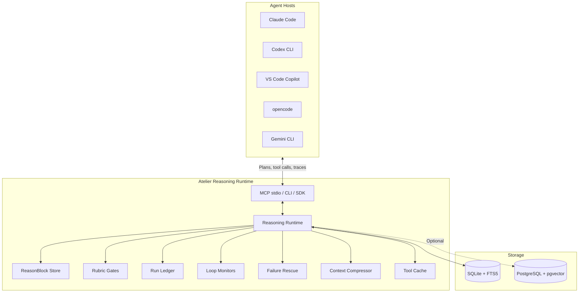

# Atelier Runtime Architecture

Atelier sits between agent hosts and their environments, acting as a reasoning and governance layer.

## Runtime Diagram

## Components

| Component           | Role                                                                                 |
| ------------------- | ------------------------------------------------------------------------------------ |
| **MCP Server**      | Stdio JSON-RPC bridge; exposes 14 tools to agent hosts                               |
| **ReasonBlock Store** | FTS5-indexed library of procedures, dead ends, and reuse patterns                  |
| **Rubric Gates**    | Domain-specific YAML-defined verification checks run against agent plans/outputs     |
| **Run Ledger**      | Per-session execution state: steps taken, tools used, cost accumulators              |
| **Loop Monitors**   | Detect thrashing (same step repeated), second-guessing, and budget exhaustion        |
| **Failure Rescue**  | Match observable error signatures against known failure clusters; surface rescue procedure |
| **Context Compressor** | Summarise ledger state to keep agent context window within budget                 |
| **Tool Cache**      | `read` (AST-aware) and `search` (FTS + semantic + guarded search) |

## Interfaces

All three interfaces call the same internal runtime:

| Interface     | How                                             | Use case                         |
| ------------- | ----------------------------------------------- | -------------------------------- |
| **MCP stdio** | `uv run atelier-mcp`                            | Agent host integration (primary) |
| **CLI**       | `uv run atelier <command>`                      | Developer workflow / debugging   |
| **Python SDK** | `from atelier.sdk import AtelierClient`        | Programmatic integration         |
| **HTTP service** | `make service` (optional)                    | Remote / multi-host deployments  |
