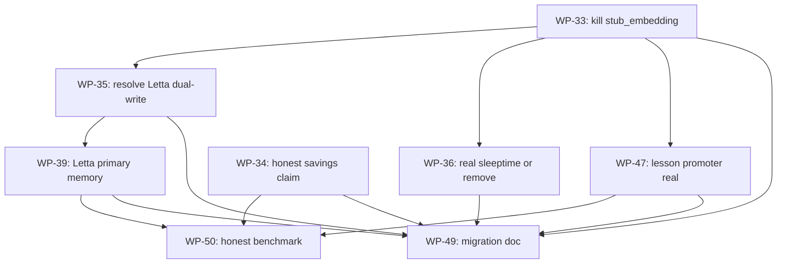

# Atelier V3 — Work-Packets Index

**Status:** Draft v2 · 2026-05-04
**Companion to:** [IMPLEMENTATION_PLAN_V3.md](../IMPLEMENTATION_PLAN_V3.md),
[IMPLEMENTATION_PLAN_V3_DATA_MODEL.md](../IMPLEMENTATION_PLAN_V3_DATA_MODEL.md),
[V2 INDEX](../work-packets/INDEX.md) (for completed history).

V3 supersedes V2 only for new work. The 32 V2 packets stay `done`. **V3 is small** — 8 packets
across 3 phases — because V3 is a cleanup release that fixes specific quality issues found in
the 2026-05-04 audit. It does not introduce a new runtime, an executor, or new dependencies.

---

## Standing rules

1. **Atelier is a tool/data provider.** It does not run an agent loop, does not call LLMs
   (other than the embeddings exception), does not spawn subagents, does not hold API keys.
   Any packet that violates this is rejected at review.
2. **Phase Z is blocking.** No Phase I or Phase J packet may start while any Phase Z packet
   is `ready` or `in_progress`. Cleanup must finish before differentiation work begins.
3. A subagent claims a packet by switching front-matter `status: ready` → `status: in_progress`,
   completes it via the standing Atelier loop + acceptance tests, then sets `status: done`.
4. Never start a packet whose `depends_on` row is not all `done`.
5. **Test layout:** `tests/core` for model/capability tests, `tests/infra` for storage tests,
   `tests/gateway` for CLI/MCP tests, `tests/docs` for documentation gates. No new test
   directories.
6. **No marketing language.** "AI-native", "self-improving", "intelligent", "autonomous" are
   banned in code, packet titles, and PR descriptions until backed by a CI-asserted
   measurement.

## Boundary labels

Every V3 packet declares one of these in its `boundary:` front-matter field:

- **Cleanup** — removes code, retracts a claim, or tightens a contract. May not add new
  subsystems and may not add runtime dependencies.
- **Atelier-core** — hardens an existing capability that Atelier already owns (memory tools,
  lesson pipeline). May not change what Atelier *is*.
- **Migration** — documents or implements V2→V3 transition. May not change runtime behavior.

There is no `OSS-adoption` or `Runtime` label in V3 because V3 does not adopt new runtime
dependencies and does not introduce a runtime.

---

## Phase Z — Truth & cleanup (blocking)

| WP                                              | Title                                              | Owner        | Boundary | Depends on | Status |
| ----------------------------------------------- | -------------------------------------------------- | ------------ | -------- | ---------- | ------ |
| [WP-33](WP-33-strip-stub-embedding.md)          | Delete `stub_embedding`; route all callers through `Embedder` | atelier:code | Cleanup  | —          | done  |
| [WP-34](WP-34-honest-savings-claim.md)          | Retract or qualify the 81 % savings headline; CI gate against unmeasured claims | atelier:code | Cleanup  | —          | done  |
| [WP-35](WP-35-resolve-letta-dual-write.md)      | Resolve `LettaMemoryStore` dual-write — pick one primary backend | atelier:code | Cleanup  | WP-33      | done  |
| [WP-36](WP-36-sleeptime-honest-or-gone.md)      | Real LLM-call sleeptime summarizer OR remove from savings story | atelier:code | Cleanup  | WP-33      | done  |

**Phase Z gate:** all four `done` before any Phase I packet starts.

---

## Phase I — Differentiation fix

Two packets that finish what V2 left half-built. Both depend on Phase Z cleanups.

| WP                                              | Title                                              | Owner        | Boundary       | Depends on | Status |
| ----------------------------------------------- | -------------------------------------------------- | ------------ | -------------- | ---------- | ------ |
| [WP-39](WP-39-letta-primary-memory.md)          | Letta as primary memory backend behind the existing `memory_*` MCP tools (no more dual-write) | atelier:code | Atelier-core  | WP-35      | done  |
| [WP-47](WP-47-lesson-promoter-real.md)          | Rebuild `LessonPromoter` clustering on real embeddings; hit precision target | atelier:code | Atelier-core  | WP-33      | done  |

---

## Phase J — Migration & honesty

| WP                                              | Title                                              | Owner        | Boundary    | Depends on            | Status |
| ----------------------------------------------- | -------------------------------------------------- | ------------ | ----------- | --------------------- | ------ |
| [WP-49](WP-49-v2-to-v3-migration-doc.md)        | V2→V3 migration doc + deprecation matrix          | atelier:code | Migration   | WP-33 … WP-47         | done  |
| [WP-50](WP-50-honest-benchmark-publish.md)      | Publish V3 honest benchmark; replace 81 % story    | atelier:code | Cleanup     | WP-34, WP-39, WP-47   | done  |

---

## Phase V3.1 — Runtime hardening

| WP                                              | Title                                              | Owner        | Boundary       | Depends on | Status |
| ----------------------------------------------- | -------------------------------------------------- | ------------ | -------------- | ---------- | ------ |
| [WP-V3.1-A](WP-V3.1-A-compact-tool-output.md)   | Threshold-triggered tool-output compaction         | atelier:code | Atelier-core   | WP-33 … WP-50 | done  |
| [WP-V3.1-B](WP-V3.1-B-pagerank-repo-map.md)     | PageRank repo map MCP tool                         | atelier:code | Atelier-core   | WP-33 … WP-50 | done  |
| [WP-V3.1-C](WP-V3.1-C-sleeptime-consolidation.md) | Sleep-time trace consolidation worker            | atelier:code | Atelier-core   | WP-V3.1-A, WP-47 | done  |
| [WP-V3.1-D](WP-V3.1-D-memory-arbitrator.md)     | Four-op memory arbitrator                          | atelier:code | Atelier-core   | WP-33 … WP-50 | done  |

---

## Dependency graph (Mermaid)

---

## Subagent contract

Same as V2 (see V2 INDEX § "Subagent contract") with one V3-specific rule:

**The boundary is enforced.** A V3 packet may not import an LLM client (`anthropic`, `openai`,
`litellm`, etc.) under `src/atelier/`. The single exception is `OpenAIEmbedder` inside
`src/atelier/infra/embeddings/`, used only for `text-embedding-3-small` (a vector lookup, not a
completion). Any packet that opens a new path to an LLM completion API is out of scope and
rejected at review.

When a packet is `done`:

- Update front-matter `status: done`.
- Update this INDEX's status column for that row.
- Record a trace with `agent: "atelier:code"`, `status: "success" | "partial"`,
  `output_summary` containing the WP id.
