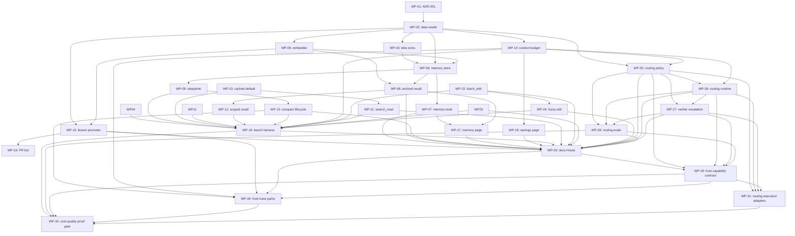

# Atelier V2 — Work-Packets Index

**Status:** Draft v1 · 2026-05-03
**Companion to:** [IMPLEMENTATION_PLAN_V2.md](../IMPLEMENTATION_PLAN_V2.md), [IMPLEMENTATION_PLAN_V2_DATA_MODEL.md](../IMPLEMENTATION_PLAN_V2_DATA_MODEL.md), [cost-performance-runtime.md](../cost-performance-runtime.md)

This is the dispatch table. A coordinator agent (or the user) hands one packet at a time to a
subagent; the subagent reads that packet's file, the two plan docs above, and any architecture docs
explicitly linked by the packet.

**Rule:** A subagent must claim a packet by switching its front-matter from `status: ready` to
`status: in_progress`, complete it (running the standing Atelier loop and the packet's acceptance
tests), then update to `status: done`. Never start a packet whose `depends_on` row is not all
`done`.

**Test layout:** use the existing repo taxonomy. Put model/capability tests in `tests/core`,
storage/runtime tests in `tests/infra`, and CLI/MCP/service/host-adapter tests in `tests/gateway`.
Do not introduce parallel `tests/unit` or `tests/integration` directories.

**Boundary labels:** packets that overlap with host CLI features must state one of these labels
before implementation begins.

- **Host-native:** the host CLI already owns the behavior. Atelier may document, configure, or call
  through it, but must not rebuild it.
- **Atelier augmentation:** Atelier adds deterministic context, memory, trace, proof, or guardrail
  behavior on top of the host feature.
- **Future-only:** the idea is named for contract completeness, but must remain disabled until a
  later packet explicitly implements and proves it.

**Host-overlap scan:** these packets need special care because Claude Code, Codex, Copilot, Gemini,
or opencode already provide part of the workflow.

| WP                                           | Boundary                                                                                        |
| -------------------------------------------- | ----------------------------------------------------------------------------------------------- |
| [WP-10](WP-10-cached-tools-default.md)       | Atelier augmentation over host-native read/search/shell tools.                                  |
| [WP-13](WP-13-compact-lifecycle.md)          | Host-native compaction stays owned by the host; Atelier preserves and reinjects runtime facts.  |
| [WP-16](WP-16-pr-bot.md)                     | Git/GitHub/`gh` stay host-native; Atelier only opens an opt-in lesson PR wrapper.               |
| [WP-21](WP-21-search-read.md)                | Atelier augmentation for token-saving search context; not a replacement shell/search surface.   |
| [WP-22](WP-22-batch-edit.md)                 | Optional deterministic batch patch executor; host-native Edit/MultiEdit remains default.        |
| [WP-23](WP-23-sql-inspect.md)                | Read-only deterministic SQL inspection; not an interactive DB client or migration tool.         |
| [WP-24](WP-24-fuzzy-edit.md)                 | Fuzzy matching only inside WP-22 batch edit; do not intercept host edit tools.                  |
| [WP-31](WP-31-routing-execution-adapters.md) | Model execution stays host-native unless a future provider packet enables provider enforcement. |

## Phase A — Foundation

| WP                                   | Title                                                          | Owner        |      Pillar      | Depends on | Status |
| ------------------------------------ | -------------------------------------------------------------- | ------------ | :--------------: | ---------- | ------ |
| [WP-01](WP-01-decision-record.md)    | Author ADR-001 explaining the V2 architecture                  | atelier:code |        —         | —          | done   |
| [WP-02](WP-02-data-model.md)         | Implement foundational V2 Pydantic models + DDL                | atelier:code | 1, 2, 3, routing | WP-01      | done   |
| [WP-03](WP-03-letta-extra.md)        | Add `letta-client` optional extra + `letta_adapter` stub       | atelier:code |        1         | WP-02      | done   |
| [WP-04](WP-04-reasonblock-tuning.md) | Tune ReasonBlock retrieval (dedup + budget) for ≥30% reduction | atelier:code |       2, 3       | —          | done   |
| [WP-05](WP-05-embedder.md)           | Implement Embedder protocol + 4 backends                       | atelier:code |     1, 2, 3      | WP-02      | done   |

## Phase B — Memory subsystem core

| WP                                     | Title                                                            | Owner        | Pillar | Depends on   | Status |
| -------------------------------------- | ---------------------------------------------------------------- | ------------ | :----: | ------------ | ------ |
| [WP-06](WP-06-memory-store.md)         | Implement `SqliteMemoryStore` + `LettaMemoryStore` adapter       | atelier:code |   1    | WP-02, WP-03 | done   |
| [WP-07](WP-07-memory-tools.md)         | MCP tools `memory_upsert_block`, `memory_get_block`              | atelier:code |   1    | WP-06        | done   |
| [WP-08](WP-08-archival-recall.md)      | MCP tools `memory_archive`, `memory_recall` + FTS+vector ranking | atelier:code |  1, 3  | WP-05, WP-06 | done   |
| [WP-09](WP-09-sleeptime-summarizer.md) | In-process sleeptime summarizer (with optional Letta delegate)   | atelier:code |  1, 3  | WP-06        | done   |

## Phase C — Context-savings instrumentation

| WP                                         | Title                                                 | Owner        | Pillar | Depends on | Status |
| ------------------------------------------ | ----------------------------------------------------- | ------------ | :----: | ---------- | ------ |
| [WP-10](WP-10-cached-tools-default.md)     | Promote `smart_read` / `cached_grep` to default-on    | atelier:code |   3    | —          | done   |
| [WP-11](WP-11-ast-truncation.md)           | AST outline-first injection for files > 200 LOC       | atelier:code |   3    | —          | done   |
| [WP-12](WP-12-scoped-recall.md)            | Wire `memory_recall` into automatic context injection | atelier:code |  1, 3  | WP-08      | done   |
| [WP-13](WP-13-compact-lifecycle.md)        | Native `/compact` lifecycle (advise + post-hook)      | atelier:code |   3    | WP-09      | done   |
| [WP-14](WP-14-context-budget-telemetry.md) | `ContextBudget` recorder + Prometheus metric          | atelier:code |   3    | WP-02      | done   |
| [WP-21](WP-21-search-read.md)              | MCP tool `search` (wozcode 1)            | atelier:code |   3    | WP-10      | done   |
| [WP-22](WP-22-batch-edit.md)               | Optional deterministic `edit` executor  | atelier:code |   3    | —          | done   |
| [WP-23](WP-23-sql-inspect.md)              | Read-only MCP `atelier sql inspect` (wozcode 4)       | atelier:code |   3    | —          | done   |
| [WP-24](WP-24-fuzzy-edit.md)               | Fuzzy matching inside `edit` only       | atelier:code |   3    | WP-22      | done   |

## Phase D — Lesson pipeline

| WP                                | Title                                                         | Owner        | Pillar | Depends on   | Status |
| --------------------------------- | ------------------------------------------------------------- | ------------ | :----: | ------------ | ------ |
| [WP-15](WP-15-lesson-promoter.md) | `LessonPromoter` capability + MCP tools `lesson_inbox/decide` | atelier:code |   2    | WP-02, WP-05 | done   |
| [WP-16](WP-16-pr-bot.md)          | Optional GitHub PR bot for promoted lessons                   | atelier:code |   2    | WP-15        | done   |

## Phase E — Frontend, Hosts, Docs, CI

| WP                                      | Title                                                                           | Owner        | Pillar  | Depends on                                                                                              | Status |
| --------------------------------------- | ------------------------------------------------------------------------------- | ------------ | :-----: | ------------------------------------------------------------------------------------------------------- | ------ |
| [WP-17](WP-17-frontend-memory-page.md)  | New `Memory.tsx` page + run inspector drawer                                    | atelier:code |    1    | WP-07, WP-08                                                                                            | done   |
| [WP-18](WP-18-frontend-savings-page.md) | Refactor `Savings.tsx` to show per-lever breakdown                              | atelier:code |    3    | WP-14                                                                                                   | done   |
| [WP-19](WP-19-bench-savings.md)         | Extend `benchmark-runtime` with `--measure-context-savings` and 11-prompt suite | atelier:code |    3    | WP-04, WP-09, WP-10, WP-11, WP-12, WP-13, WP-14, WP-21, WP-22, WP-23, WP-24                             | done   |
| [WP-20](WP-20-docs-and-hosts.md)        | Update host integration docs + skill files for the new tools                    | atelier:code | 1, 2, 3 | WP-07, WP-08, WP-13, WP-15, WP-17, WP-18, WP-19, WP-21, WP-22, WP-23, WP-24, WP-25, WP-26, WP-27, WP-28 | done   |

## Phase F — Quality-Aware Routing

| WP                                        | Title                                                | Owner        | Pillar  | Depends on          | Status |
| ----------------------------------------- | ---------------------------------------------------- | ------------ | :-----: | ------------------- | ------ |
| [WP-25](WP-25-routing-policy.md)          | Implement quality-aware routing policy configuration | atelier:code | routing | WP-02, WP-14        | done   |
| [WP-26](WP-26-routing-runtime.md)         | Add quality-aware router runtime integration         | atelier:code | routing | WP-25, WP-14        | done   |
| [WP-27](WP-27-verification-escalation.md) | Implement verification-gated escalation policy       | atelier:code | routing | WP-25, WP-26        | done   |
| [WP-28](WP-28-routing-evals.md)           | Add routing cost-quality evals                       | atelier:code | routing | WP-25, WP-26, WP-27 | done   |

## Phase G — Host Contract And Proof Gate

| WP                                           | Title                                            | Owner        | Pillar | Depends on                        | Status |
| -------------------------------------------- | ------------------------------------------------ | ------------ | :----: | --------------------------------- | ------ |
| [WP-29](WP-29-host-capability-contract.md)   | Host capability and enforcement contract         | atelier:code | proof  | WP-20, WP-25, WP-26, WP-27, WP-28 | done   |
| [WP-30](WP-30-host-trace-parity.md)          | Host trace parity and confidence levels          | atelier:code | proof  | WP-13, WP-14, WP-15, WP-20, WP-29 | done   |
| [WP-31](WP-31-routing-execution-adapters.md) | Routing execution adapters and enforcement modes | atelier:code | proof  | WP-25, WP-26, WP-27, WP-29        | done   |
| [WP-32](WP-32-cost-quality-proof-gate.md)    | Final cost-quality proof gate                    | atelier:code | proof  | WP-19, WP-28, WP-29, WP-30, WP-31 | done   |

## Dependency graph (Mermaid)

## Subagent contract

packet, such as `cost-performance-runtime.md` for routing packets
`status: partial` and stop
`output_summary` containing the packet ID
front-matter and this index
